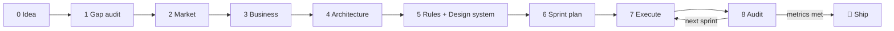

# Keel 🛟 — a portable product-development harness for AI agents

> **Working name `Keel` is provisional** — vet a final name on GitHub/npm/USPTO before publishing the namespace.

[](./LICENSE)
[](https://agents.md)
[](https://agentskills.io)
[](https://context7.com)
[](./CONTRIBUTING.md)

**Keel** is a copy-in kit of plain markdown — skills, rules, slash-commands, and agent definitions —
that drives a software **product** from a raw idea to shipped code through **9 audited phases**. It is
a *methodology engine*: stateful, auditable, and resumable. It installs into any repo and works across
**Claude Code, Cursor, GitHub Copilot, Codex, Windsurf** and any AGENTS.md-aware agent.

## Why
Most AI coding setups jump straight to code. Keel front-loads the thinking — clarify the idea, research
the market, decide architecture, **freeze the rules**, plan sprints — then makes every sprint a control
loop that re-audits the living code against those frozen rules. The best model **thinks**; cheaper
models **execute**. Live library docs come from **Context7**, so code is written against current APIs,
not stale memory.

## 60-second quickstart

```bash
# 1. Fetch Keel into your project (greenfield)
npx giget@latest gh:OWNER/keel-harness ./my-product
cd ./my-product

# 2. Open in Claude Code (or Cursor) and talk to the installer
/keel-init        # detects your project, asks ~8 questions, writes config + state

# 3. Drive the lifecycle, one audited step at a time
/keel-status      # → "Phase 0. Next: capture your idea"
/idea-intake      # … then /contextualize, /choose-architecture, /define-conventions,
                  #     /plan-sprints, /start-sprint, /close-sprint
```

No Claude Code? The same `AGENTS.md` + `.claude/skills/` are read natively by Cursor, Copilot and
Codex; run the phases by name.

## The 9 phases



Each phase writes named artifacts under `product/` and is guarded by an **exit gate** the orchestrator
audits before advancing. State lives in one file: `harness/state.yaml`. Full spec:
[`harness/methodology.md`](./harness/methodology.md).

## Supported tools

| Tool | Procedures (skills) | Project law (AGENTS.md) | Always-on rule | Model tiering |
|---|---|---|---|---|
| Claude Code | native | via `@AGENTS.md` in `CLAUDE.md` | `CLAUDE.md` | ✅ per-agent |
| Cursor | native (`.claude/skills/`) | native | `.cursor/rules/00-keel.mdc` | prose intent |
| GitHub Copilot / VS Code | native | native | — | prose intent |
| Codex / Gemini CLI | native | native | — | prose intent |
| Windsurf | partial | native | `.windsurf/rules/00-keel.md` | prose intent |

Generated adapters are re-rendered from a single source by `/keel-doctor` — no hand-editing, no drift.

## MCP / Context7
Keel ships a secret-free [`.mcp.json`](./.mcp.json) wiring **Context7** (essential, live library docs)
and **sequential-thinking**. A free Context7 key is recommended for active build sprints. Optional:
git/GitHub, fetch, filesystem, Playwright (UI sprints only). See [`SECURITY.md`](./SECURITY.md) for the
least-privilege guidance.

## Cost-aware orchestration
Three self-contained agents ship with Keel — `keel-orchestrator` (Opus, think/audit),
`keel-builder` (Sonnet, implement), `keel-scout` (Haiku, search). If you have specialist packs
installed, Keel prefers them; otherwise it works with the three built-ins. One bump point for model
IDs: [`docs/agents-and-models.md`](./docs/agents-and-models.md).

## Deep audits — put the project on trial
`/keel-tribunal` runs a standing, **whole-project adversarial debate**: a steelman Defense vs a
red-team Prosecution plus a dissent-forcing Catfish argue every assumption across idea, market,
business model, architecture, scope, rules, and code. Cheaper tiers debate; the Opus judge rules
**per claim** and every claim must cite on-disk evidence or it's struck. It complements `/close-sprint`
(which checks a sprint against the frozen rules) by asking the prior question — *were those decisions
right?* Output is a ranked findings report frozen to `.harness/debates/debate-NN.md`. See a worked
run in [`examples/taskpilot/.harness/debates/debate-01.md`](./examples/taskpilot/.harness/debates/debate-01.md).

## Worked example
[`examples/taskpilot/`](./examples/taskpilot/) is a fully-populated greenfield product showing every
phase artifact, a per-sprint audit, and a runnable code slice.

## Status
**v0.1 (build-phase 1):** greenfield, Claude Code + AGENTS.md floor, core skills, Context7. Roadmap:
market/business skills, full Cursor/Windsurf re-render, plugin marketplace, brownfield (with dry-run),
design-system components. See [`CHANGELOG.md`](./CHANGELOG.md) and [`VERSIONING.md`](./VERSIONING.md).

## License
[Apache-2.0](./LICENSE). Contributions welcome — see [`CONTRIBUTING.md`](./CONTRIBUTING.md).
