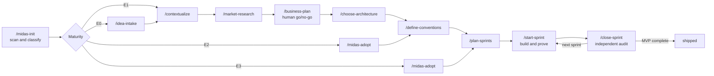
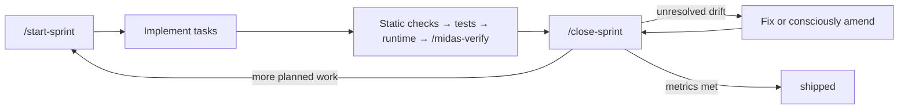
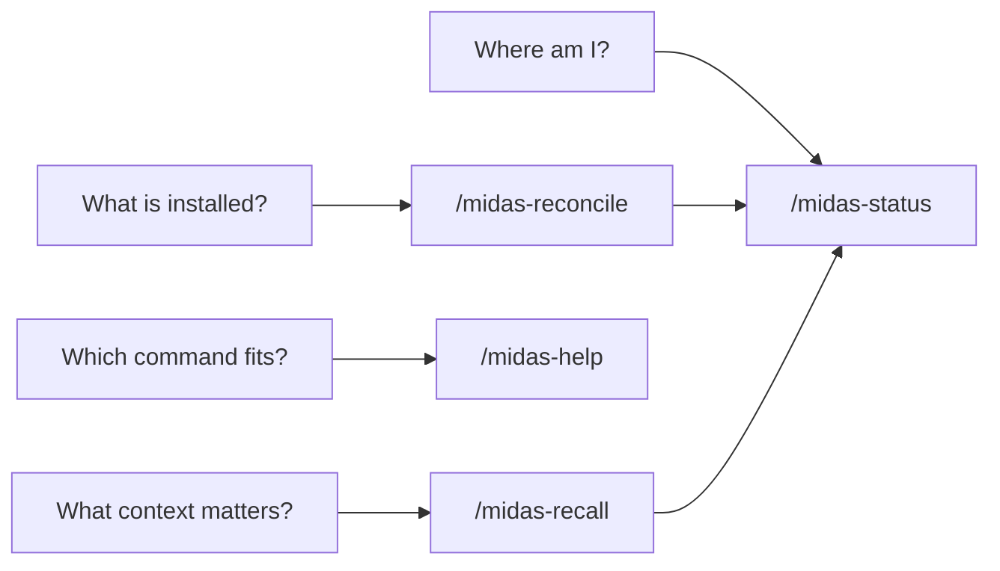
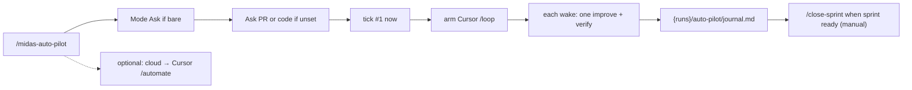

# Skill flows

This guide explains the shape of each Midas skill without repeating its step-by-step procedure.
Use it to understand where a command starts, what decision it owns, what it leaves on disk, and
where control normally goes next.

The canonical procedure remains each `harness/skills/<name>/SKILL.md`. Lifecycle routing at runtime
comes from `<paths.engine>/stage-command-table.yaml` (generated from `STAGE_ROWS` in
`scripts/stage-command-table.mjs` — edit the JS rows, then `doctor --fix` / `align`). State
semantics come from `harness/state.schema.md`.

## How to read the flows

Every skill reads `paths.state` first. A skill that writes state does so last, after its artifacts
exist. State has four useful layers:

- **Lifecycle:** `stage` + `stage_status` are the program counter.
- **Gate ledger:** `phases.*` records artifacts and pass/pending status.
- **Sprint loop:** `sprints[]` records planned, active, blocked, and done work.
- **Pointers:** `last_verification`, `last_security`, and similar fields point to frozen records;
  they do not advance the lifecycle.

There are three kinds of flow:

- **Advancing:** completes a phase gate or moves a sprint toward `shipped`.
- **In-place:** creates evidence or changes project files but leaves `stage` unchanged.
- **Read-only:** explains or diagnoses state without writing project files.

## Whole-system flow

Phase 8 runs **in place** while the top-level stage remains `sprint_execution`; `audit` is a ledger
phase, not a top-level runtime stage.

**Lite branch** (`track: lite` during `/midas-init` — see `<paths.engine>/pipeline/lite.md`): skip
`/market-research` and `/business-plan` as Next; Idea+Plan writes stubs including thin
`business-plan.md`, then `/plan-sprints` → `/start-sprint` → `/close-sprint`.

## Pipeline skills

These are the advancing path. The producer writes artifacts; the orchestrate-tier gate checks
on-disk evidence before the lifecycle advances.

| Skill | Starts from | Core flow | Leaves behind | On success |
|---|---|---|---|---|
| `/idea-intake` | Initialized E0 project | Preserve raw idea, clarify it, normalize the pitch | `{product}/idea.md` | `idea_intake` → `contextualize` |
| `/contextualize` | Idea captured | Find gaps, ask only blockers, repeat until none remain | Revised `idea.md` + `open-questions.md` | `contextualize` → `market_research` |
| `/market-research` | Zero blocking product questions | Fan out cited research, challenge claims, synthesize demand | `{product}/market.md` | `market_research` → `business_case` |
| `/business-plan` | Market gate passed | Define MVP, non-goals, metrics, economics, then ask go/no-go | `{product}/business-plan.md` + human sign-off | GO → `tech_architecture`; NO-GO → stop |
| `/choose-architecture` | Signed GO business case | Surface hard-to-reverse forks, verify versions, record decisions | `architecture.md` + one ADR per decision | Gate pass → `architecture_rules` |
| `/define-conventions` | Architecture and ADRs accepted | Turn architecture into checkable rules, design system, and enforcement | Rules, design docs, playbooks, rendered adapters | Gate pass → `sprint_planning` |
| `/plan-sprints` | Rules frozen | Decompose only the MVP into dependency-ordered, shippable slices | Roadmap, sprint files, `features.json`, planned `sprints[]` | Gate pending; next `/start-sprint` |
| `/start-sprint` | Planned sprint | Audit pre-existing drift, form working plan, activate the sprint | Drift decisions + active sprint | `sprint_planning` → `sprint_execution` |
| `/close-sprint` | Active sprint with work proven | Independently audit rules and scope, resolve drift, freeze verdict | `{runs}/audits/audit-NN.md` + done sprint | Next sprint, or `shipped` |

The front-loaded lifecycle is linear; the recurring product-development loop is:

## Orientation and continuity

These skills are read-only. They can be used without disturbing the current phase.

| Skill | Starts from | Core flow | Output | Typical handoff |
|---|---|---|---|---|
| `/midas-status` | Any valid state | Read program counter and gate status | About six lines with one next command | Run the printed command |
| `/midas-help` | An intent, optionally current state | Ask one routing question | What, exact command, effect, when not, next | Run the selected command |
| `/midas-recall` | A resumed phase or sprint | Select the smallest useful context pack | Priority paths + a short current-state brief | Continue current work or use status |
| `/midas-reconcile` | Missing/confusing install, cwd, or version | Diagnose install orientation | One CLI or slash-command next step | Init, adopt, update, or status |

## Sprint-day and investigation skills

These operate inside or beside the Phase-7 loop. They create evidence or improve work, but they do
not pass a phase gate. **Surface** (ADR-013): primary skills stay in `/midas-help`; **internal**
skills are path-passed by parents (read body — not Skill-tool invoke).

### Primary (user-facing)

| Skill | Starts from | Core flow | Leaves behind | State effect / handoff |
|---|---|---|---|---|
| `/midas-verify` | Landed UI/API acceptance journeys | Drive the running product and inspect runtime health | `verify-NN.md` + screenshots | Sets `last_verification`; then close |
| `/midas-explore` | Question outside the lifecycle path | Open an append-only investigation, gather notes, close it | `{runs}/explore/<slug>/` | May propose capture; stage unchanged |
| `/midas-capture` | A recurring, user-approved pattern | Classify as rule, playbook, or convention; amend or create | Project-owned durable guidance | Doctor after rule changes |
| `/midas-design` | UI that needs a stronger product identity | Audit, present three directions, obtain a choice, specify one | `design-NN.md`; optional one-slice implementation | Implement or verify; stage unchanged |
| `/midas-auto-pilot` | Product context and/or optional `--autonomy` | Bare: Mode Ask (evolve vs sprint vs stop). **Evolve:** Ask PR\|code; runbook; local tick#1+`/loop` or cloud draft. **Sprint:** guide `setup`/`dry-run`; human runs CLI `tick` | `{runs}/auto-pilot/*` and/or `{runs}/autonomy/` | Never auto-`tick` ADR-009 from chat; aliases forward here |
| `/midas-investigate` | Bug / failed self-fix needs root cause | Iron Law + 3 strikes; freeze symptoms→flow→hypotheses | `{runs}/investigate/inv-NN.md` | Non-advancing; then fix + regression |
| `/midas-retro` | After a sprint lands (or on demand) | Index sprint/progress/audit excerpts; draft went-well / hurt / learned / carry | `{runs}/retros/retro-NN.md` | Non-advancing; may propose `/midas-capture` |

### Internal (path-pass under orchestrators)

| Skill | Natural parent | Core flow | Leaves behind | State effect / handoff |
|---|---|---|---|---|
| `/midas-progress` | `/start-sprint` + `pipeline/7-sprint-execution.md` | Capture done work, proof, tools, observations, and next task | `{runs}/sprints/NN-progress.md` | Refreshes `last_touched`; continue |
| `/midas-qa` | Phase 7 inner loop / status | Map the diff to affected screens and exercise them | Optional ad-hoc QA record | Fix or continue; never replaces verify |
| `/midas-diff-gates` | `/close-sprint` Step 0.5 | Diff-scoped test/quality receipts | `{paths.cache}/gates/<run>/` | Receipts or documented skip before conformance |
| `/midas-lean-review` | `/close-sprint` / fat-diff | Rank delete, stdlib, native, YAGNI, and shrink findings | Optional `lean-NN.md` | Apply only after approval |
| `/midas-sweep` | `/close-sprint`, `/midas-adopt`, status | Find dead flows, orphans, stale docs, ledger drift | `sweep-NN.md` | Stage unchanged; `--fix` needs confirm |

Optional bounded loop (ADR-009) beside the manual sprint cycle:

Requires `.harness/autonomy/` (`npx … --autonomy`). See `/midas-auto-pilot` (Sprint checklist) and `.harness/autonomy/README.md`.

Complementary continuous evolve (no `--autonomy` required):

See `/midas-auto-pilot` and `<paths.engine>/templates/auto-pilot-runbook.md.tmpl`.

## Maintenance, setup, and standing audits

These skills either establish Midas, keep generated surfaces aligned, or produce optional evidence.
Except for intake/adoption placement, they do not advance lifecycle gates.

| Skill | Starts from | Core flow | Leaves behind | State effect / handoff |
|---|---|---|---|---|
| `/midas-init` | Installed but not initialized project, or version/layout behind | Diagnose → tip install (stop) / intake / tip `--update` / ready→status | Writable `.harness/` layout and initial state, or CLI tip | Sets `setup_complete` when intake runs; routes by maturity |
| `/midas-adopt` | E2/E3 codebase | Inventory reality, infer architecture/rules, baseline audit, confirm wiring | Inventory, as-built architecture, debt, rules, baseline audit | Places E2 at rules; E3 at sprint planning |
| `/midas-hygiene` | Dirty product repo / pre-close fat diff | Path-pass sweep scope `product` + optional lean-review | `{runs}/sweeps/sweep-NN.md` (+ lean notes) | Stage unchanged; human OK for deletes |
| `/midas-doctor` | Any installation | Check layout, routing, enforcement, gates, and adapter drift | Health report; optional regenerated managed files | Stage unchanged |
| `/midas-align` | Substantive engine/product change | Map diff to propagation surfaces, run the alignment ladder | Alignment or gap report; regenerated mirrors as needed | Stage unchanged |
| `/midas-precommit` | Engine-repo contributor PR (not a product menu item) | Score architecture, security, tests, DX against the engine bar | Precommit report | Engine-only; installs do not list it in `/midas-help` |
| `/midas-bundle` | Portable knowledge needed | Select profile, export/import, verify checksums, preview conflicts | Knowledge JSON or confirmed imported files | Stage unchanged by default |
| `/midas-tribunal` | A decision needs adversarial challenge | Argue opposing cases across evidence; independent judge rules | `debate-NN.md` | Informational; bridge actions back to work |
| `/midas-security-audit` | Code and architecture available | Threat-model, scan, rank, and route security findings | `security-NN.md` | Sets optional pointer; never passes a gate |

Hygiene `/midas-hygiene` is **primary** (path-passes internal sweep/lean). Sweep alone remains
**internal** — see Sprint-day internals above. Deprecated `/midas-update` → `/midas-init`.

## Design seams worth reviewing

The flow map exposes a few deliberate seams that are useful when evolving the design:

1. **Production and judgment are separate.** Phase artifacts can be drafted cheaply; binding gates
   remain independent orchestrate-tier decisions.
2. **Only pipeline skills advance.** Verification, security, design, tribunal, sweep, lean review,
   and retro inform a gate but never impersonate one. UX demote of internals (ADR-013) does **not**
   merge audits (ADR-004) or auto-invoke `disable-model-invocation` skills.
3. **State stays small.** Long-form evidence lives under `{product}/` and `{runs}/`; state stores the
   program counter, ledgers, and pointers.
4. **Human choices are explicit.** Go/no-go, irreversible architecture, visual direction, rule
   amendments, deletions, and ship decisions have visible approval boundaries.
5. **The main complexity sits at handoffs.** The highest-value redesign questions are whether each
   skill has one unambiguous entry condition, one durable output, and one next-command contract.

When a skill changes, update this map only if its entry condition, state effect, durable output, or
handoff changes. Procedure-only edits belong in the skill itself and its pipeline playbook.
