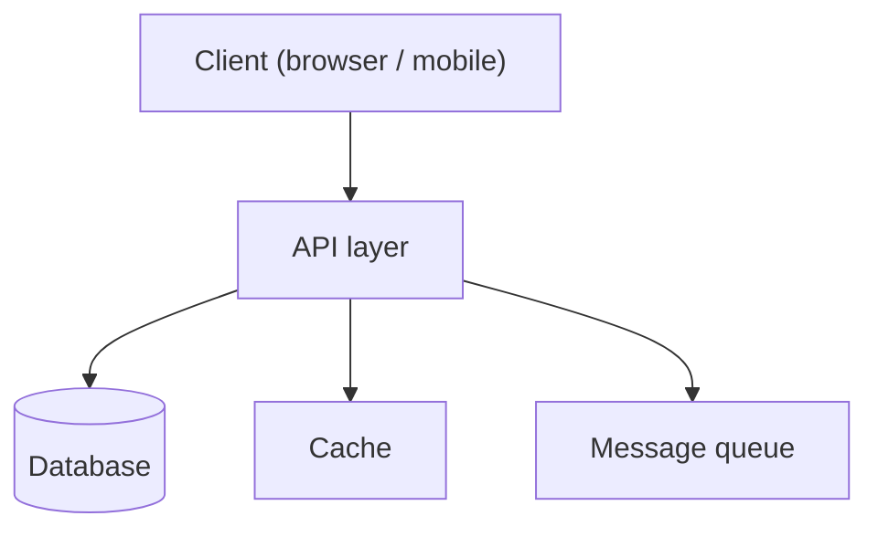

<!-- Phase 4 — Tech Architecture artifact. Orchestrator decides; stack must be Context7-verified.
     Exit gate: stack pinned & Context7-verified, system diagram present, >=1 ADR per major decision,
     all business requirements covered. -->

# Architecture — {{PROJECT_NAME}}

## System overview

<!-- TODO: 2-3 sentence description of the system — what it does, its deployment model -->

…

## Architecture diagram

<!-- TODO: ASCII or Mermaid diagram showing major components and data flows.
     Mermaid example below — replace with actual system. -->

## Stack decisions

<!-- All stack choices must be Context7-verified (resolve-library-id → get-library-docs).
     Each row links to the ADR that justifies the choice. -->

| Layer | Technology | Version | ADR | Context7 verified |
|---|---|---|---|---|
| Frontend | <!-- TODO --> | <!-- TODO --> | [ADR-001](./adr/ADR-001.md) | [ ] |
| Backend | <!-- TODO --> | <!-- TODO --> | [ADR-002](./adr/ADR-002.md) | [ ] |
| Database | <!-- TODO --> | <!-- TODO --> | [ADR-003](./adr/ADR-003.md) | [ ] |
| Auth | <!-- TODO --> | <!-- TODO --> | [ADR-004](./adr/ADR-004.md) | [ ] |
| Hosting / infra | <!-- TODO --> | <!-- TODO --> | [ADR-005](./adr/ADR-005.md) | [ ] |

## Requirements coverage

<!-- TODO: trace each business requirement from business-plan.md to the component that satisfies it -->

| Requirement | Component | Notes |
|---|---|---|
| … | … | … |

## Non-functional requirements

<!-- TODO: latency targets, availability SLA, scalability assumptions, security requirements -->

- **Latency:** …
- **Availability:** …
- **Scale assumptions:** …
- **Security:** …

## Open technical risks

<!-- TODO: risks not resolved by the ADRs — carry into sprint planning -->

- …

## ADR index

<!-- TODO: one ADR per major decision (template: harness/templates/ADR.md) -->

- [ADR-001](./adr/ADR-001.md) — <!-- title -->
- [ADR-002](./adr/ADR-002.md) — <!-- title -->

---

*Gate check: stack pinned ✓, Context7-verified ✓, diagram present ✓, ≥1 ADR per decision ✓, requirements covered ✓.*
*Next: run `/define-conventions` (Phase 5).*
