# Análisis comparativo: gstack vs Midas Harness

| Campo | Valor |
|---|---|
| **Fecha de revisión** | 2026-06-30 |
| **Midas analizado** | `harness/VERSION` → **0.5.21** |
| **gstack analizado** | README público de [garrytan/gstack](https://github.com/garrytan/gstack) (landing/marketing; no se auditó el código fuente de gstack) |
| **Tipo de documento** | Análisis comparativo — **no modifica el motor del harness** |

> **Aviso de vigencia:** gstack y Midas evolucionan con rapidez. Las capacidades de gstack se describen
> como *afirmadas por su README*, salvo donde Midas se verifica contra archivos de este repositorio.
> Las propuestas de adopción al final son **recomendaciones**, no decisiones implementadas.

---

## 1. Resumen ejecutivo

**gstack** (Garry Tan, YC) es un conjunto de **23+ skills y 8 power tools** para Claude Code (y otros
agentes) que modela un sprint lineal: **Think → Plan → Build → Review → Test → Ship → Reflect**. Según
su README, optimiza velocidad, paralelismo (10–15 sprints simultáneos) y automatización operativa
(navegador real, memoria persistente GBrain, deploy).

**Midas Harness** es un **harness metodológico portable** de **9 fases auditadas** (idea → shipped) con
contrato `**CHECK:**` en reglas, separación explícita productor/auditor, routing de modelos por tiers
(orchestrate / build / scout) y adapters multi-tool generados desde una sola fuente
(`harness/conventions.md`).

### Diferencia filosófica

| Dimensión | gstack (según README) | Midas |
|---|---|---|
| Unidad de trabajo | Skill invocable en cualquier momento | Fase con gate y artefactos congelados |
| Verdad del proyecto | Skills encadenados + GBrain (memoria externa) | `product/*`, `harness/*`, `.harness/*` en git |
| Quién audita | `/review`, `/qa`, `/cso` como herramientas | Fase 8 (`/close-sprint`) — auditor independiente obligatorio |
| Coste de QA | `/qa` siempre disponible, agresivo | `/midas-verify` gated a sprints UI (MCP caros) |

### Scorecard rápido

| Dimensión | Veredicto | Nota breve |
|---|---|---|
| **Pipeline / gates** | **Midas** | 9 fases con gate + sign-off humano; gstack es sprint lineal sin gates duros |
| **Reglas verificables** | **Midas** | Contrato `**CHECK:**` por ítem en `harness/rules/`; digest en adapters |
| **Testing / QA** | **gstack** (amplitud) / **Midas** (disciplina) | gstack: auto-fix + regresión + benchmark + canary; Midas: escalera 5 peldaños + ledger `features.json` |
| **Seguridad** | **Empate** | gstack `/cso` (OWASP+STRIDE); Midas `/midas-security-audit` (ASVS L1–L3 + LLM/Agentic) |
| **Diseño visual** | **gstack** | design-shotgun, design-html, design-consultation; Midas: tokens + reglas + verify UI |
| **Memoria / continuidad** | **Distinto** | gstack GBrain (vector/store); Midas git-visible + ADR-003 (sin store oculto) |
| **Portabilidad multi-tool** | **Empate** | gstack ~10 hosts; Midas 6 hosts con adapters generados |
| **Deploy / operate** | **gstack** | land-and-deploy, canary; Midas termina en `shipped` + audit |

---

## 2. Inventario lado a lado

### 2.1 gstack (según README público)

**Flujo de sprint declarado:** Think → Plan → Build → Review → Test → Ship → Reflect.

**Skills principales (roles especializados):**

| Skill gstack | Rol declarado |
|---|---|
| `/office-hours` | Interrogación de producto (6 preguntas forzadas) |
| `/plan-ceo-review` | Revisión estratégica / alcance |
| `/plan-eng-review` | Arquitectura, diagramas, tests, edge cases |
| `/plan-design-review` | Diseño UI (0–10 por dimensión, anti-slop) |
| `/plan-devex-review` | Experiencia de desarrollador (API/CLI/SDK) |
| `/design-consultation` | Design system desde cero |
| `/design-shotgun` | 4–6 mockups IA + tablero comparativo |
| `/design-html` | Mockup → HTML producción (Pretext) |
| `/review` | Staff engineer — bugs de producción, auto-fix |
| `/investigate` | Debugging causa raíz (Ley de Hierro) |
| `/design-review` | Auditoría diseño post-ship + fixes |
| `/devex-review` | DX audit en vivo (TTHW, onboarding) |
| `/qa` | QA con navegador real, fix + test regresión |
| `/qa-only` | QA sin cambios de código |
| `/cso` | OWASP Top 10 + STRIDE |
| `/ship` | Tests, cobertura, PR |
| `/land-and-deploy` | Merge + CI + verificar producción |
| `/canary` | Monitoreo post-deploy |
| `/benchmark` | Core Web Vitals, performance |
| `/document-release` | Actualizar docs tras ship (Diataxis) |
| `/document-generate` | Generar docs faltantes (Diataxis) |
| `/retro` | Retrospectiva semanal |
| `/autoplan` | Pipeline CEO → design → eng automático |
| `/spec` | Spec ejecutable con quality gate |
| `/learn` | Memoria entre sesiones (gstack) |
| `/browse`, `/open-gstack-browser` | Navegador Chromium controlado por IA |
| `/pair-agent` | Coordinación multi-agente en navegador compartido |
| `/codex` | Segunda opinión OpenAI Codex |

**Power tools:** `/careful`, `/freeze`, `/guard`, `/unfreeze`, `/gstack-upgrade`, setup-* (deploy, gbrain, cookies).

**Infra adicional (README):** GBrain (memoria persistente), checkpoint mode (`WIP:` commits), telemetría opt-in, binarios (`gstack-model-benchmark`, `gstack-taste-update`, iOS QA daemon).

### 2.2 Midas Harness (verificado en este repo)

**Flujo:** Fases 0–5 (una vez) → 6 (plan) → bucle 7 (execute) ⇄ 8 (audit) → `shipped`.

**21 skills** en `.claude/skills/`:

| Skill Midas | Fase / rol |
|---|---|
| `/idea-intake` | 0 — Idea |
| `/contextualize` | 1 — Gap loop |
| `/market-research` | 2 — Mercado |
| `/business-plan` | 3 — Business case + go/no-go humano |
| `/choose-architecture` | 4 — Stack + ADRs |
| `/define-conventions` | 5 — Reglas + design system (keystone) |
| `/plan-sprints` | 6 — Roadmap + sprints |
| `/start-sprint` | 7 — Kickoff sprint |
| `/close-sprint` | 8 — Auditoría conformidad |
| `/midas-init`, `/midas-adopt` | Setup / brownfield |
| `/midas-status`, `/midas-recall` | Orientación / context pack |
| `/midas-doctor`, `/midas-update` | Mantenimiento engine |
| `/midas-verify` | QA UI (Playwright + DevTools) |
| `/midas-sweep` | Hygiene / dead-flow |
| `/midas-tribunal` | Debate adversarial |
| `/midas-security-audit` | OWASP ASVS + STRIDE |
| `/midas-capture` | Patrones → regla/playbook |
| `/midas-monorepo` | Monorepo |

**3 agentes tier:** `midas-orchestrator` (Opus), `midas-builder` (Sonnet), `midas-scout` (Haiku) — ver [agents-and-models.md](agents-and-models.md).

**6 hosts:** claude-code, cursor, windsurf, gemini, codex, copilot — adapters en `scripts/render-adapters.mjs`.

### 2.3 Tabla de equivalencias aproximadas

| gstack (README) | Midas | Cobertura |
|---|---|---|
| `/office-hours` | `/contextualize` + `/idea-intake` | Parcial — Midas no “reformula el producto” con el mismo tono CEO |
| `/plan-ceo-review` | `/business-plan`, `/midas-tribunal` (lens scope) | Parcial |
| `/plan-eng-review` | `/choose-architecture`, Fase 4 playbook | Parcial |
| `/plan-design-review` | `/define-conventions` + reglas visual-design | Parcial — sin skill interactivo 0–10 |
| `/plan-devex-review` | — | **No** |
| `/review` | Fase 8 + reglas code-quality | Parcial — sin auto-fix dedicado |
| `/investigate` | verify→fix en Fase 7 | **No** (sin metodología explícita) |
| `/qa` | `/midas-verify` | Parcial — verify no auto-fix ni regresión automática |
| `/cso` | `/midas-security-audit` | Alta |
| `/ship` | humano commit + CI; no skill ship | Parcial |
| `/retro` | — | **No** |
| `/document-release` | regla `docs.md` | Parcial — sin skill generador |
| `/autoplan` | — | **No** |
| `/learn` + GBrain | `/midas-capture`, `/midas-recall`, ADR-003 | Distinto modelo |
| `/browse` | Playwright/DevTools MCP vía `/midas-verify` | Parcial — sin browser stack propio |

---

## 3. Dónde Midas ya iguala o supera

### 3.1 Gates auditados y trazabilidad

Midas congela evidencia de **sprints** en `.harness/audits/audit-NN.md` y `.harness/verifications/verify-NN.md`
con líneas parseables (`MIDAS_AUDIT_RESULT: …`, `MIDAS_VERIFY_RESULT: …`). Los **gates de fase** (0–6)
congelan en `.harness/gates/gate-0N.md` cuando el skill de fase cierra. El avance de
`harness/state.yaml → stage` requiere veredicto orchestrate-tier. gstack encadena skills pero **no
documenta gates formales** en el README.

Referencias: [methodology.md](methodology.md), `harness/pipeline/8-audit-adjust.md`.

### 3.2 Contrato CHECK en reglas

Cada ítem en `harness/rules/*.md` lleva `**CHECK:**` (grep, comando o `manual:`). El digest se inyecta
en `.cursor/rules/00-midas.mdc`, `GEMINI.md`, etc. Phase 8 evalúa **todas** las reglas contra el diff
del sprint.

Referencias: `harness/conventions.md`, `harness/rules/` (14 reglas base + stack-specific en Fase 5).

### 3.3 Productor ≠ auditor

La escalera de verificación (`harness/rules/verification.md`) exige que el peldaño 5 (veredicto de
conformidad) lo renderice un revisor **independiente** — típicamente `/close-sprint` en tier orchestrate.
El productor corre peldaños 1–4 en el inner loop de Fase 7.

### 3.4 Tribunal adversarial

`/midas-tribunal` (Defense / Prosecution / Catfish) responde “¿fueron correctas las **decisiones**?” —
distinto de “¿el código cumple las reglas?” (Fase 8). gstack no describe un equivalente en el README.

### 3.5 Seguridad profunda

`/midas-security-audit`: OWASP **ASVS 5.0** (L1/L2/L3), Top 10, LLM/Agentic Top 10 cuando aplica,
STRIDE, SAST/SCA/secrets. Complementa la regla always-on `harness/rules/security.md`.

gstack `/cso`: OWASP Top 10 + STRIDE con gate de confianza 8/10+ (según README). Midas va más lejos en
**niveles ASVS** documentados.

### 3.6 Routing de modelos enforced

Tiers `orchestrate` / `build` / `scout` con agentes Claude Code pinned; `node scripts/doctor.mjs`
reconcilia `state.yaml → routing` con `.claude/agents/midas-*.md`. gstack declara auto-routing en
browser sidebar pero no un contrato de tiers equivalente.

### 3.7 Adapters multi-tool desde una fuente

`scripts/render-adapters.mjs` genera `CLAUDE.md`, `.cursor/rules/00-midas.mdc`, `.windsurf/rules/00-midas.md`,
`GEMINI.md` desde `harness/conventions.md` + reglas. CI falla si hay drift.

### 3.8 Fases 0–3 (producto y mercado)

Midas incluye **market research**, **business case con go/no-go humano** y **ADRs** como fases obligatorias
antes del código. gstack asume que `/office-hours` y reviews de plan cubren esto de forma más ligera,
sin artefactos `product/market.md` / `product/business-plan.md` estandarizados.

---

## 4. Deep dive: Testing y QA

Esta sección responde a la pregunta central: **¿qué nos aporta gstack en testeo que Midas no tiene, y
qué debemos adoptar?**

### 4.1 Modelo gstack (según README)

| Capacidad | Descripción declarada |
|---|---|
| **`/qa`** | Abre navegador real, recorre flujos, encuentra bugs, **los corrige con commits atómicos**, re-verifica, **genera test de regresión por cada fix** |
| **`/qa-only`** | Misma metodología sin tocar código — solo informe |
| **`/review`** | Staff engineer: bugs que pasan CI; **auto-fix** de obvios; flags de completitud |
| **`/investigate`** | **Ley de Hierro:** ningún fix sin investigación; traza flujo de datos; **para tras 3 fixes fallidos** |
| **`/codex`** | Segunda opinión cross-model (Claude + OpenAI); análisis de solapamiento de hallazgos |
| **`/ship`** | Sync main, tests, **auditoría de cobertura**, PR; **bootstrapea framework de tests** si no existe; meta 100% cobertura |
| **`/benchmark`** | Baseline Core Web Vitals y tamaños de recurso; comparar before/after por PR |
| **`/canary`** | Loop post-deploy: errores consola, regresiones performance, fallos de página |
| **Checkpoint mode** | Commits `WIP:` con cuerpo `[gstack-context]`; `/ship` squash antes del PR |

**Filosofía implícita:** el agente **es** el QA lead — encuentra, arregla, prueba y documenta en un solo
comando. Optimizado para paralelismo (el README atribuye pasar de 6 a 12 workers gracias a `/qa`).

### 4.2 Modelo Midas (verificado)

#### Escalera de 5 peldaños (`harness/rules/verification.md`)

| Peldaño | Qué prueba | Quién |
|---|---|---|
| 1 Static | typecheck, lint, build | Productor (inner loop) |
| 2 Tests | suite verde; cambio de comportamiento ↔ test en mismo diff | Productor |
| 3 Smoke | boot sin crash | Productor |
| 4 Browser | Playwright drive + DevTools inspect; registro verify | Productor → evidencia Fase 8 |
| 5 Audit | `/close-sprint` — todas las reglas CHECK | **Auditor orchestrate** |

Principio: **herramienta más barata que demuestre el claim**; no saltar peldaños (no abrir browser
para un error de tipos).

#### Regla de testing (`harness/rules/testing.md`)

19 CHECKs: comportamiento vs implementación, integración en límites de arquitectura, E2E o verify por
criterio de aceptación, CI obligatorio, no skip sin issue, etc.

#### `/midas-verify` (`.claude/skills/midas-verify/SKILL.md`)

- **Gated:** solo sprints que tocan UI (MCP caros).
- Playwright: drive flows, screenshots, selectores estables.
- Chrome DevTools: errores consola, red happy-path, **spot-check CWV/Lighthouse** (ya mencionado en
  `verification.md` peldaño 4).
- Salida: `.harness/verifications/verify-NN.md` + `MIDAS_VERIFY_RESULT: …`
- **No** auto-fix ni generación automática de tests de regresión documentada en el skill.

#### Ledger `product/features.json`

Cada feature `status: passing` exige `evidence` no vacío (ruta de test, ruta, o registro verify).
Fase 8 falla si hay comportamiento enviado sin entrada o sin evidencia.

#### Hygiene (`/midas-sweep` + `harness/rules/hygiene.md`)

Detecta dead flows, drift del ledger, playbooks zombi — complementa testing funcional con **honestidad
del inventario de features**.

### 4.3 Comparativa fina testing/QA

| Aspecto | gstack (README) | Midas | Gap |
|---|---|---|---|
| Tests unitarios/integración | `/ship` exige suite + cobertura | Peldaño 2 + `testing.md` CHECKs | Paridad en intención; gstack bootstrap explícito |
| QA navegador | `/qa` siempre, auto-fix | `/midas-verify` gated, report-only | **gstack más agresivo en fix loop** |
| Test regresión por bug | **Automático en `/qa`** | Manual vía convención testing | **Gap Midas** |
| Segunda opinión modelo | `/codex` cross-model | `/midas-tribunal` (mismo vendor posible) | **Gap Midas** para diversidad de modelo |
| CWV / performance | `/benchmark` dedicado | Spot-check en verify (peldaño 4) | **Gap Midas** (sin baseline PR) |
| Post-deploy | `/canary` | No (termina en `shipped`) | **Gap Midas** si se opera en prod |
| Debugging sistemático | `/investigate` + freeze | verify→fix sin metodología | **Gap Midas** |
| Cobertura 100% meta | Declarada en `/ship` | No declarada como meta | Filosófico |
| Productor corrige en QA | Sí (`/qa`) | No en verify (auditor separado en Fase 8) | **Diseño Midas** — más rigor, menos velocidad |
| Evidencia parseable | Implícito en PR | `MIDAS_*_RESULT` + `.harness/*` | **Midas superior** en audit trail |

### 4.4 Qué conviene adoptar (testing/QA)

Priorizado por encaje con la filosofía Midas (productor prueba; auditor certifica):

| # | Adopción propuesta | Encaje | Notas de implementación futura |
|---|---|---|---|
| a | **Test de regresión obligatorio por bug corregido** en inner loop Fase 7 | Alto | Ampliar `testing.md` CHECK + playbook en `harness/pipeline/7-sprint-execution.md`; no requiere auto-fix |
| b | **`/midas-investigate`** (Ley de Hierro, 3 strikes) | Alto | Skill build-tier, non-advancing; enlaza con `verification.md` |
| c | **Segunda opinión cross-model** (opcional en close-sprint o pre-merge) | Medio | Power-tool; requiere Codex u otro CLI; no sustituye Fase 8 |
| d | **`/midas-benchmark`** o extensión verify | Medio | CWV baseline en `.harness/verifications/`; solo UI |
| e | **`/canary`** | Bajo (alcance) | Solo si se define Fase 9 operate — fuera del MVP actual |

**Qué no copiar tal cual:** el loop `/qa` que auto-fixea sin pasar por auditor independiente choca con
“el productor nunca se califica solo” — mejor: productor genera fix + test + verify record; Fase 8 certifica.

---

## 5. Matriz de gaps completa

Leyenda: **Encaje** = alineación con filosofía Midas (git-visible, gates, CHECK). **Esfuerzo** = bajo /
medio / alto. Fuente gstack = README salvo indicación.

| Capacidad gstack | Midas hoy | Encaje | Valor | Esfuerzo | Recomendación |
|---|---|---|---|---|---|
| `/office-hours` | `/contextualize`, `/idea-intake` | Medio | Medio | — | Ya cubierto en parte; opcional tono “CEO pushback” en contextualize |
| `/plan-ceo-review` | `/business-plan`, tribunal | Medio | Medio | — | Parcial |
| `/plan-eng-review` | Fase 4 | Alto | — | — | Cubierto |
| `/plan-design-review` | reglas + Fase 5 | Medio | Medio | Medio | Skill interactivo opcional |
| `/plan-devex-review` | — | Alto | Alto (API/CLI) | Medio | **Adoptar** skill + playbook |
| `/devex-review` | — | Alto | Alto | Medio | Par de plan-devex |
| `/design-consultation` | Fase 5 design-direction | Medio | Medio | Alto | Evaluar |
| `/design-shotgun` | — | Bajo | Alto visual | Alto | Aplazar — acoplado a generación IA imágenes |
| `/design-html` | tokens + componentes | Bajo | Medio | Alto | Aplazar |
| `/review` auto-fix | Fase 8 | Medio | Alto | Medio | Inner-loop fix sí; veredicto en Fase 8 |
| `/investigate` | — | Alto | Alto | Bajo | **Adoptar** `/midas-investigate` |
| `/qa` + regresión | `/midas-verify` | Alto | Alto | Medio | **Adoptar** regresión por bug en reglas |
| `/qa-only` | verify (parcial) | Alto | Medio | Bajo | Modo report-only en verify |
| `/cso` | `/midas-security-audit` | — | — | — | Empate |
| `/ship` | CI + humano | Medio | Medio | Medio | Evaluar skill “pre-PR checklist” no gate |
| `/land-and-deploy` | — | Medio | Medio | Alto | Aplazar (Fase 9) |
| `/canary` | — | Medio | Medio | Alto | Aplazar |
| `/benchmark` | spot en verify | Alto | Medio | Medio | **Evaluar** `/midas-benchmark` |
| `/document-release` | `docs.md` | Alto | Alto | Medio | **Adoptar** `/midas-doc` |
| `/document-generate` | templates | Alto | Alto | Medio | Parte de `/midas-doc` |
| `/retro` | — | Alto | Alto | Medio | **Adoptar** `/midas-retro` |
| `/autoplan` | tribunal (parcial) | Alto | Alto | Alto | **Evaluar** `/midas-autoplan` |
| `/spec` | sprint templates | Medio | Medio | Medio | Evaluar |
| `/learn` + GBrain | capture + recall | **Bajo** | Alto (gstack) | Alto | **Rechazar** store oculto — ver ADR-003 |
| `/browse` stack propio | MCP Playwright | Bajo | Alto | Muy alto | No replicar browser factory |
| `/pair-agent` | — | Bajo | Medio | Muy alto | Aplazar |
| `/codex` 2ª opinión | tribunal | Alto | Alto | Medio | **Evaluar** |
| `/careful` `/freeze` `/guard` | — | Alto | Alto | Bajo | **Adoptar** regla + hook |
| checkpoint + context-restore | progress.md, recall | Alto | Medio | Medio | **Evaluar** WIP commits estructurados |
| `/make-pdf` `/diagram` | — | Medio | Bajo | Medio | Nice-to-have |
| `gstack-model-benchmark` | doctor routing | Medio | Bajo | Medio | Evaluar |
| Telemetría opt-in | ninguna | — | — | — | Mantener sin telemetría Midas |
| 10 hosts vs 6 | 6 + adapters | — | — | — | Empate suficiente |
| iOS QA daemon | — | Medio | Nicho | Alto | Solo si stack iOS |
| Prompt-injection browser | — | Bajo | Alto seguridad | Muy alto | No replicar |
| Parallel 10–15 sprints | methodology + tiers | Medio | Alto | — | Documentar Conductor/worktrees; no skill |

---

## 6. Recomendaciones priorizadas

### 6.1 Adoptar ya (encaje fuerte, llena hueco real)

| Propuesta | Taxonomía Midas futura | Rationale |
|---|---|---|
| **`/midas-retro`** | `.claude/skills/midas-retro/SKILL.md`; salida `.harness/retros/retro-NN.md`; non-advancing | gstack tiene `/retro`; Midas solo audita conformidad en close-sprint |
| **`/midas-investigate`** | Skill build-tier; playbook `product/playbooks/debug-root-cause.md`; refuerzo `verification.md` | Ley de Hierro + 3 strikes reduce “fixes al azar” |
| **Salvaguardas careful/freeze/guard** | `harness/rules/safety-guardrails.md` + hook lefthook/pre-tool; skills opcionales `/midas-freeze` | Alineado con `security.md`; bajo esfuerzo |
| **`/midas-doc`** | Skill build-tier; Diataxis map en PR body o `.harness/docs/doc-NN.md` | Cierra gap document-release/generate |
| **Regresión por bug en inner loop** | CHECK nuevo en `testing.md` + paso en `7-sprint-execution.md` | Cierra el gap más importante vs `/qa` sin romper separación auditor |

### 6.2 Evaluar (valor alto, decisión de alcance)

| Propuesta | Consideración |
|---|---|
| Segunda opinión cross-model | Requiere Codex CLI o similar; útil pre-Fase-8, no sustituto |
| DevEx review (plan + live) | Imprescindible para productos API-first; no cubierto hoy |
| `/midas-autoplan` | Orquesta reviews pre-build; costoso en tokens; alternativa: checklist en `start-sprint` |
| Checkpoint + context-restore | WIP commits con cuerpo estructurado; compatible con `git-commits.md` si squash en close |
| `/midas-benchmark` | Extensión UI; baseline en verify records |

### 6.3 Descartar o aplazar

| Tema | Razón |
|---|---|
| **GBrain / vector memory** | [ADR-003](adr/ADR-003-project-memory-model.md): memoria git-visible; `/midas-recall` + capture — sin store oculto |
| **Browser stack propio** (stealth, sidebar, pair-agent, ML anti-injection) | Superficie enorme; Midas usa MCP opcionales |
| **design-shotgun / design-html** | Generación visual IA; Midas es token/rule-driven en Fase 5 |
| **land-and-deploy / canary** | Cambia alcance a Fase 9 operate; no es “idea → shipped” actual |
| **Telemetría** | Midas sin phone-home por diseño |

### 6.4 Cómo encajaría cada adopción (propuesta, no implementado)

```
Nueva skill side-effecting → disable-model-invocation: true + usuario escribe /comando
Nueva regla → harness/rules/<slug>.md con **CHECK:** + /midas-doctor
Pipeline → harness/pipeline/*.md + plantilla en harness/templates/
Evidencia → .harness/<tipo>/<slug>-NN.md + MIDAS_*_RESULT parseable
```

---

## 7. Diagrama de flujos comparados

```mermaid
flowchart TB
  subgraph gstack_flow [gstack segun README]
    OH[office-hours] --> APR[autoplan o plan reviews]
    APR --> BUILD[implementar]
    BUILD --> REV[review]
    REV --> QA[qa]
    QA --> SHIP[ship]
    SHIP --> RETRO[retro]
  end

  subgraph midas_flow [Midas verificado]
    P0[0 idea] --> P1[1 contextualize]
    P1 --> P2[2 market]
    P2 --> P3[3 business]
    P3 --> P4[4 architecture]
    P4 --> P5[5 rules]
    P5 --> P6[6 plan sprints]
    P6 --> P7[7 execute + verify loop]
    P7 --> P8[8 close-sprint audit]
    P8 -->|next sprint| P7
    P8 -->|done| SHIPPED[shipped]
  end
```



---

## 8. Apéndice

### 8.1 Fuentes

**gstack (solo README / landing):**

- https://github.com/garrytan/gstack — README principal (junio 2026, ~118k stars declaradas)
- Documentos citados en README: `ARCHITECTURE.md`, `BROWSER.md`, `ETHOS.md`, `docs/skills.md` — **no verificados en este análisis**

**Midas (archivos de este repositorio):**

| Tema | Ruta |
|---|---|
| Metodología | `harness/methodology.md`, [methodology.md](methodology.md) |
| Verificación | `harness/rules/verification.md`, `harness/rules/testing.md` |
| QA UI | `.claude/skills/midas-verify/SKILL.md` |
| Seguridad | `.claude/skills/midas-security-audit/SKILL.md`, `harness/rules/security.md` |
| Memoria | [ADR-003](adr/ADR-003-project-memory-model.md), `.claude/skills/midas-capture/SKILL.md` |
| Adapters | `scripts/render-adapters.mjs`, `scripts/doctor.mjs` |
| Skills índice | [skills.md](skills.md) |
| Agentes | [agents-and-models.md](agents-and-models.md) |
| Arquitectura repo | [repository-architecture.md](repository-architecture.md) |

### 8.2 Cómo replicar este análisis

1. **Inventariar gstack:** leer README + `docs/skills.md` en su repo; marcar cada skill como “afirmada”.
2. **Inventariar Midas:** listar `.claude/skills/*/SKILL.md`, `harness/pipeline/*.md`, `harness/rules/*.md`.
3. **Construir tabla de equivalencias** y matriz gaps (sección 5).
4. **Profundizar testing:** contrastar `/qa` vs `verification.md` + `midas-verify` (sección 4).
5. **Filtrar por filosofía:** rechazar lo que contradiga ADR-003 (memoria oculta) o separación auditor.
6. **Actualizar** fecha y `harness/VERSION` en la cabecera cuando se rehaga el ejercicio.

### 8.2.1 Mejoras Midas implementadas (verificación / MCP)

Tras el análisis de gaps de flujo (2026-06-30), el engine incorpora:

| Mejora | Dónde |
|---|---|
| Trazabilidad **Tool** por tarea | `harness/templates/sprint-progress.md`, Fase 7 playbook |
| CHECK auditable de herramienta/MCP en verify | `harness/rules/verification.md` rung 4 |
| Onboarding UI (Playwright + DevTools) | `/midas-init`, `docs/getting-started.md`, `mcp.json.tmpl` |
| Drift `state.yaml → mcp:` vs `.mcp.json` | `scripts/doctor.mjs` (`mcp:declared-vs-wired`, advisory) |

**Móvil nativo (follow-up, no implementado):** cuando Fase 4 fije cliente iOS/Android, evaluar en Fase 5
una ruta de verificación dedicada. Candidatos a estudiar (sin compromiso): **Maestro** (flows declarativos),
**Detox** (React Native), **Appium** (multi-plataforma). Hasta entonces, `verification.md` documenta que el
stack automatizado Midas es **web browser**; gstack `/ios-qa` no tiene equivalente en Midas.

### 8.3 Próximo paso sugerido

**Ya implementado (2026-06-30):** el plan de verificación/MCP de la sección 8.2.1 — trazabilidad Tool,
CHECK en `verification.md`, onboarding UI, y check advisory en `doctor.mjs`. Ver `CHANGELOG.md` §
[Unreleased].

**Pendiente (adopciones gstack, sección 6.1):** si el equipo aprueba las filas “Adoptar ya”, el
siguiente sprint dedicado sería: `/midas-retro`, `/midas-investigate`, salvaguardas careful/freeze/guard,
`/midas-doc` (Diataxis), y regresión obligatoria por bug en el inner loop de Fase 7 — cada uno como
skill/regla nuevo con propagación `npm run build`.

---

*Documento de análisis gstack vs Midas Harness. Las adopciones implementadas se documentan en §8.2.1 y `CHANGELOG.md`; el código vive en `harness/`, `scripts/` y `.claude/skills/`.*
