# Comparative analysis: muninn-harness vs Midas Harness

> **Language note:** This page is a community comparative analysis originally written in Spanish,
> following the same format as [`gstack-comparison.md`](gstack-comparison.md). Harness artifacts
> (skills, rules, CI) remain English-only per CONTRIBUTING.md.

| Campo | Valor |
|---|---|
| **Fecha de revisión** | 2026-07-29 |
| **Midas analizado** | `harness/VERSION` (single source of truth) |
| **muninn-harness analizado** | Código fuente completo del repositorio local `muninn-harness` (welocalize), tag más reciente **v0.4.9** (`eabaa5b`), auditado directamente (no solo README) |
| **Tipo de documento** | Análisis comparativo — **no modifica el motor del harness** |
| **Alcance** | Arquitectura, conceptos, mecanismos de utilización (hooks, skills, scripts, CLI), flujo end-to-end, y matriz de mejoras propuestas para Midas |

---

## 1. Resumen ejecutivo

**muninn-harness** es un harness **mono-herramienta** (Cursor únicamente) orientado a **equipos de
ingeniería con Jira/GitHub reales**: instala un motor (`.cursor/skills|hooks|rules`) más una capa de
datos (`.ai-flow/`) en cada *workspace*, y gobierna el trabajo día a día con un flujo **por ticket**
(`/flow KEY-XXXX`) de 7 fases, memoria persistente con *scoring* (BM25 + señales + decaimiento
temporal), un mapa de contexto del repo indexado, auditoría adversarial multi-persona, y **seguridad
mecánica vía hooks** (no solo reglas escritas) que bloquean comandos destructivos, commits no
solicitados y fugas de secretos.

**Midas Harness** es un **harness metodológico multi-herramienta** (Claude Code, Cursor, Windsurf,
Gemini, Codex, Copilot) de **9 fases auditadas** que gobierna el ciclo de vida completo de un
*producto* (idea → mercado → negocio → arquitectura → reglas → sprints → shipped), con contrato
`**CHECK:**` verificable en cada regla, separación productor/auditor obligatoria, *routing* de modelos
por tiers, y adapters generados desde una única fuente (`harness/conventions.md`).

### Diferencia filosófica central

| Dimensión | muninn-harness | Midas |
|---|---|---|
| **Unidad de trabajo** | El **ticket Jira** (`/flow KEY-XXXX`), resumible con máquina de estados fina (7 fases + reparación) | La **fase de producto** (0–8) y, dentro de la 7, el **sprint** |
| **Alcance temporal** | Vive **dentro** del ciclo de desarrollo de un producto ya existente (brownfield permanente) | Cubre **todo** el ciclo, desde que el producto no existe (idea) hasta que se declara `shipped` |
| **Verdad del proyecto** | `.ai-flow/` (memoria, contexto, tareas) — local, git-ignorado, **no viaja con el repo de producto** | `.harness/product/*`, `harness/*`, `.harness/runs/*` — **versionado en git**, viaja con el repo |
| **Portabilidad de herramienta** | Cursor **exclusivamente** (hooks, MCP, subagentes son primitivas de Cursor) | 6 hosts vía adapters generados desde una fuente común |
| **Seguridad** | **Mecánica**: hooks bash interceptan la llamada a herramienta antes de ejecutarse (`permission: deny/ask/allow`) | **Declarativa**: reglas `always-on` con `**CHECK:**` que un auditor (o el propio productor) evalúa después del hecho |
| **Memoria** | Motor de *recall* con scoring multi-señal, BM25 + RRF, decaimiento temporal, *auto-capture* con umbrales | Rutas curadas (`/midas-recall`) + captura manual aprobada por el usuario (`/midas-capture`); sin scoring ni corpus indexado |
| **Quién certifica** | El propio agente (`/audit`, `/qa`) — sin auditor independiente obligatorio | El **auditor** (`orchestrate` tier, típicamente `/close-sprint`) — el productor nunca se autocalifica |
| **Costo de contexto por turno** | *Carryover* explícito por fase (~1 archivo pequeño), nunca la skill completa salvo transición | Digest de reglas siempre inyectado (`00-midas.mdc`/`CLAUDE.md`) + recall bajo demanda |

### Scorecard rápido

| Dimensión | Veredicto | Nota breve |
|---|---|---|
| **Seguridad mecánica (hooks)** | **muninn** | Bloqueo real a nivel de *tool call* (deny/ask/allow); Midas solo tiene reglas que el agente puede ignorar |
| **Gates de producto / ciclo de vida completo** | **Midas** | 9 fases con gate + sign-off humano; muninn no tiene fase 0-6 (idea, mercado, negocio, arquitectura) — asume que el producto ya existe |
| **Memoria / recall** | **muninn** | Scoring multi-señal + BM25 + decaimiento + dedupe + cuotas; Midas es lectura de rutas fijas sin ranking |
| **Granularidad de resiliencia de estado** | **muninn** | Reglas de reparación determinista (`meta.yml` desincronizado, fases inconsistentes); Midas no define reparación explícita de `state.yaml` |
| **Reglas verificables** | **Midas** | Contrato `**CHECK:**` por ítem, con `kind: command|manual` y severidad; muninn no tiene un contrato equivalente por regla |
| **Coste/lazy-loading de contexto** | **muninn** | *Carryover* por fase, *staleness nudges*, mapa de contexto consultado (nunca volcado) | 
| **Testing / QA** | **Empate con matices** | muninn: `/browser-qa` + `/api-qa` (OpenAPI, Schemathesis) reportan y NO auto-arreglan salvo confirmación; Midas: escalera de 5 peldaños + ledger `features.json`, pero sin QA de API por spec |
| **Auditoría de código** | **muninn** (amplitud) / **Midas** (independencia) | muninn: 7+ subagentes adversariales en paralelo por auditoría; Midas: Fase 8 + reglas CHECK, un solo auditor pero *independiente por diseño* |
| **Portabilidad multi-tool** | **Midas** | 6 hosts vs 1 (Cursor) |
| **Producto (mercado/negocio/arquitectura)** | **Midas** | Fases 2-4 no tienen equivalente en muninn |
| **Export/import de conocimiento** | **Empate** | Ambos tienen bundle JSON portable (`muninn export/import` vs `/midas-bundle`) |

---

## 2. Inventario detallado — muninn-harness

### 2.1 Filosofía y capas

muninn instala **tres piezas cooperantes** en la raíz del *workspace* (README.md, `docs/README.md`):

| Capa | Ruta | Rol |
|---|---|---|
| **Engine** | `.cursor/` | Skills (procedimientos slash-command), hooks (seguridad dirigida por eventos), rules (guardarraíles siempre activos `.mdc`) |
| **Data** | `.ai-flow/` | Config, memoria durable, mapa de contexto del repo, tareas por ticket, preferencias, métricas |
| **Contrato** | `AGENTS.md` | El contrato operacional que el agente lee **cada turno de chat** |

Todo es **local y git-ignorado por defecto** — el harness nunca se commitea al repo de producto. Esto
es una diferencia de diseño fundamental frente a Midas, donde `.harness/` (o `harness/` en el propio
motor) **sí se versiona** porque *es* la memoria del proyecto.

### 2.2 CLI de instalación (`bin/muninn.js`, ~1432 líneas, sin dependencias)

Comandos (`package.json` → `bin.muninn`):

| Comando | Función |
|---|---|
| `pnpm dlx github:welocalize/muninn-harness` (install) | Copia el engine a `.cursor/`, siembra `.ai-flow/` desde `skeleton/`, autodetecta `repos.json`, construye el mapa de contexto |
| `-- update` (pinneado a tag) | Sobrescribe skills/hooks/rules/scripts; **fusiona** claves nuevas de nivel superior y sub-claves anidadas de `config.yml` (`mergeConfigFromSkeleton`, `mergeNestedConfigSubkeys`); fusiona comandos slash y fila `active_flow_session` en `AGENTS.md` (`ensureAgentsSlashCommands`, `ensureAgentsCriticalTable`); fusiona bloque `.gitignore` preservando líneas extra del usuario |
| `-- remove [--keep-data] [--keep-agents]` | Desinstala engine + `.ai-flow/` + `AGENTS.md` + bloque `.gitignore` |
| `-- export [--out=] [--memory-only]` | Bundle JSON portable: `memory/entries/`, `context/conventions.md`, `preferences.md`, `preference-candidates.md`, `config.yml` |
| `-- import <bundle> [--overwrite]` | No destructivo por defecto; sanea rutas (solo *basenames* `.md`); reconstruye catálogos tras importar (`memory_sync.py`, `repo_context_refresh.py`) |

Puntos de diseño notables (leídos directamente del código, no del README):

- `parseTopLevelYamlBlocks` + `mergeNestedConfigSubkeys` — el instalador hace **fusión estructural de YAML** en `update`, no una sobrescritura ciega; preserva IDs de Jira/GitHub del usuario mientras añade claves nuevas (`browser_qa`, `api_qa`, `subagents`, etc.) introducidas en versiones posteriores.
- `ensureAgentsCriticalTable` sincroniza solo la fila `active_flow_session` de `AGENTS.md` cuando aún referencia texto de *carryover* obsoleto — evita pisar personalizaciones del usuario en el resto del archivo.
- `writeHarnessVersionStamp` + `runHarnessDoctorHints` — tras instalar/actualizar corre un *doctor* (advertencias, nunca bloqueante) — análogo a `scripts/doctor.mjs` de Midas pero ejecutado automáticamente al final de cada instalación/actualización.
- `autoDetectReposJson` — heurística para poblar `.ai-flow/context/repos.json` (qué carpetas son repos de producto) en el primer install.

Midas no tiene un equivalente de fusión estructural de config en `cli/index.mjs`/`/midas-update`
tan granular a nivel de sub-claves anidadas; su `/midas-update` usa **dry-run + diff-confirm** (más
seguro, pero más manual).

### 2.3 El motor `.cursor/` — skills

19 skills en `harness/cursor/skills/*/SKILL.md` (instalados en `.cursor/skills/`), agrupados en el
README en 4 categorías:

**Core workflow**

| Skill | Trigger | Qué hace |
|---|---|---|
| `flow` | `/flow KEY-XXXX` o sesión activa | Pipeline por ticket de 7 fases (ver §2.6) |
| `explore` | `/explore [topic\|PR\|file]` | Investigación ligera sin ticket; 2–3 subagentes de solo lectura en paralelo |
| `resume` | `/resume <PR\|KEY-XXXX\|diff\|texto>` | Resumen corto: cambio + historia de usuario + tabla de pruebas E2E; solo lectura |

**Memoria y contexto**

| Skill | Trigger | Qué hace |
|---|---|---|
| `recall` | auto / `/recall` | Ver §2.7 |
| `auto-capture` | proactivo tras trabajo durable | Escribe entradas de memoria con *gates* (dedupe, ≤2/ticket, ≥150 LOC) |
| `refresh-memory` | `/refresh-memory --consolidate` | Barre entradas por vejez/deriva; propone consolidación |
| `context` | auto (sessionStart) / `/context` | Ver §2.8 |
| `conventions` | `/conventions` | Extrae convenciones de reglas + skills + código + patrones de PR reales hacia `conventions.md` |

**Revisión y calidad**

| Skill | Trigger | Qué hace |
|---|---|---|
| `audit` | `/audit` | Auditoría adversarial multi-persona (ver §2.9) |
| `workspace-conventions-reviewer` | invocado por `/audit` | Subagente que aplica `conventions.md` + memoria local |
| `pr-review` | `/pr-review <PR>` | Revisión de nivel *staff* de un PR remoto; comenta inline en GitHub con `## Intent` |
| `pr-reply` | `/pr-reply` | Responde todos los hilos de revisión abiertos tras aplicar fixes |
| `review-jira` | `/review-jira KEY-XXXX` | Puntúa y mejora el summary/description de un ticket (formato INVEST) |
| `browser-qa` | `/browser-qa` | QA de navegador *report-only* (ver §2.10) |
| `api-qa` | `/api-qa` | QA de API desde spec OpenAPI/Swagger (ver §2.10) |

**Plataforma y setup**

| Skill | Trigger | Qué hace |
|---|---|---|
| `onboarding` | `/onboarding` | Asistente de primer uso: salud + IDs Jira/GitHub + idioma; scaffolding vía `harness_init.py` |
| `prefs` | `/prefs [--learn]` | Capa de preferencias de estilo de trabajo; *batch-learn* minando transcripts |
| `github-mcp` | push/PR | Fuerza el uso del MCP de GitHub en vez de `git push`/`gh` |
| `help` | `/help` | Guía interactiva |
| `migrate` | `/migrate` | Export/import de conocimiento curado |

### 2.4 La capa de datos `.ai-flow/` — scripts Python

`harness/ai-flow/scripts/` (instalado en `.ai-flow/scripts/`), sin dependencias externas más allá de
`stdlib` (implícito por cómo se invocan con `python3` directo):

| Script | Propósito | Invocación típica |
|---|---|---|
| `harness_doctor.py` | Chequeo de salud: claves de config, mapa de contexto, estado, limpieza del repo | `python3 .ai-flow/scripts/harness_doctor.py` |
| `harness_smoke.py` | Smoke post-instalación: doctor + 1 query de contexto opcional | tras instalar/actualizar |
| `harness_init.py` | Scaffolding idempotente para `/onboarding` | llamado por la skill |
| `repo_context_refresh.py` | Reconstruye `symbols.json`, `repo-map.json`, `project-context.md` | `/refresh-context` |
| `auto_refresh.py` | Refresca si está obsoleto (edad de manifest / HEAD de git) + escribe `staleness.json`. **Fail-open**, activado por defecto | hook `sessionStart`; `--check` / `--run` |
| `repo_context_query.py` | Consulta el mapa por tema (solo stdout, nunca vuelca el JSON entero) | `repo_context_query.py "<topic>" --limit 8` |
| `repo_context_lib.py` | Librería compartida (rutas del workspace, parsing) | importado |
| `memory_sync.py` | Reconstruye `memory/index.md` + `candidates.md` desde `entries/` | tras captura |
| `bm25_recall.py` | Recall léxico BM25, fusionado con scoring semántico vía RRF | `/recall --bm25` |
| `analyze_pr_review_patterns.py` | Extrae feedback recurrente de PRs para `/conventions` | `/conventions` |
| `analyze_chat_preferences.py` | Mina transcripts de Cursor para señales de estilo de trabajo (redactadas, con umbral) | `/prefs --learn` |
| `clean_workspace.py` | Limpia basura + archiva tareas cerradas obsoletas (nunca la sesión activa) | `[--archive] [--dry-run]` |
| `qa-login.mjs` | Sesión de login para `/browser-qa` en entornos *lower-env* (bypass captcha/OTP), escribe la sesión a `.ai-flow/e2e/.auth/`; **rechaza explícitamente producción** | invocado por `browser-qa` antes de drivear flujos autenticados |

`repo_context_lib.py` (librería núcleo del mapa de contexto) ignora `.git`, `node_modules`,
`.ai-flow`, `.cursor`, y extrae símbolos por lenguaje: funciones/tipos Go (`func`/`type`) y exports
TS/Vue (incluyendo *stores* Pinia y *composables*) — de ahí el sentido de `context_map.max_symbols`
(8000) como tope.

**Confirmación de la filosofía "sin store oculto" también en muninn**: no existe ningún
`semantic_recall.py` ni script de embeddings en el árbol — `harness_doctor.py` está escrito para
**fallar** si detecta uno, es decir, el proyecto evita activamente reintroducir memoria vectorial. Es
una simetría interesante con el ADR-003 de Midas: ambos proyectos, de forma independiente, rechazaron
una base de memoria vectorial/semántica oculta y optaron por texto plano + señales determinísticas. La
diferencia real está en la **sofisticación del scoring sobre texto plano** (BM25 + señales +
decaimiento en muninn) frente a **rutas fijas** (Midas), no en si hay o no un *vector store*.

Tests unitarios dedicados en `harness/ai-flow/scripts/tests/` (`test_harness_scripts.py`,
`test_repo_context.py`, `test_auto_refresh.py`), corridos por `npm test` →
`python3 -m unittest discover -s harness/ai-flow/scripts/tests -p 'test_*.py' -v` + `node --check
bin/muninn.js`.

**Nota de privacidad** (`docs/automation.md`): `analyze_chat_preferences.py` descubre *solo* el
proyecto Cursor de este workspace, muestrea con límites (500 archivos / 200 turnos por archivo),
**redacta** rutas home, tokens AWS/GitHub, JWT, Bearer, emails y pares `secret=…` antes de escribir o
imprimir nada, y solo promueve una señal tras verla ≥ `promotion_threshold` veces (revisión humana).

### 2.5 `harness/cursor/hooks/` — seguridad mecánica (el diferenciador más grande)

8 hooks bash, cableados en `hooks.json`, cada uno disparado por un evento nativo de Cursor:

| Hook | Evento | Qué hace | Fail-mode |
|---|---|---|---|
| `gate-commits.sh` | antes de shell | Fuerza un `permission: ask` en el IDE para cualquier `git commit`/`push`; deja pasar `--dry-run` | **fail-closed** (`set -euo pipefail`; comando vacío → `deny`) |
| `block-destructive-bash.sh` | antes de shell | Bloquea `rm -rf /|~|.`, force-push a `main`/`master`, `git reset --hard` con árbol sucio | **fail-closed**, con *fallback* de regex bash si falta `jq` (nunca abre en degradado) |
| `protect-ai-flow.sh` | antes de shell | Bloquea `git add/commit` sobre `.ai-flow/`; pregunta en `git stash`/`git init` sospechosos | fail-closed en degradado (pregunta, no permite) |
| `redact-secrets-prompt.sh` | antes de enviar el prompt | Bloquea prompts con claves AWS (`AKIA…`), Bearer tokens, asignaciones `PASSWORD=`/`SECRET=`/`API_KEY=` | deniega si detecta patrón |
| `lint-after-edit.sh` | después de editar (`afterFileEdit`) | Corre `go vet` sobre archivos `.go` con timeout de 3s; **no** lintea Vue/TS en el hook (demasiado lento para un hook síncrono) | fail-open |
| `check-pr-on-stop.sh` | al terminar el turno (`Stop`) | Si hay PR abierto para la rama activa, resume checks fallidos/pendientes de CI (`gh pr checks`) | nunca bloquea, solo informa |
| `log-context-cost.sh` | inicio de sesión | Registra coste de contexto en `metrics/` contra una baseline | — |
| `auto-refresh-context.sh` | inicio de sesión | Corre `auto_refresh.py --check`; si el mapa está obsoleto, lo refresca en un **proceso detached en background** (`nohup … & disown`) — coste cero de tokens del agente | **fail-open** (cualquier fallo, continúa la sesión) |

**Contrato explícito del proyecto** (`docs/automation.md`): *"Skills describe intent; hooks enforce
boundaries. Even if a procedure is misread, destructive bash, unrequested commits, and secret leaks
are stopped mechanically."* Es decir: muninn asume que un LLM puede **ignorar o malinterpretar** una
regla en markdown, y por eso duplica las invariantes de seguridad más críticas como código
determinista que se ejecuta **antes** de que la herramienta corra — no como una convención que el
propio agente debe recordar aplicar.

Esto contrasta con el modelo de Midas: `harness/rules/git-commits.md` y `harness/rules/security.md`
son **reglas `**CHECK:**` auditadas por Fase 8** (después del hecho, por un agente auditor), pero
**nada impide mecánicamente** que el agente ejecute `git push --force` o pegue un secreto en un
prompt durante la Fase 7 — la única salvaguarda es que el propio modelo siga la regla, más el ítem
`git-commits.md` "commit/push only when the human asks" que también depende de que el agente lo
respete voluntariamente.

### 2.6 `flow` — la unidad de trabajo central (7 fases por ticket)

`harness/cursor/skills/flow/` está deliberadamente **partido** en un `SKILL.md` "caliente" (~190
líneas, siempre resida en contexto) más 7 archivos de fase planos (commit `3ac41ee`: *"Split flow
skill into hot SKILL.md plus flat phase files"*), cargados **uno a la vez** según la fase activa:

| Fase | Archivo | Contenido |
|---|---|---|
| 0 | `0-init.md` | Init + triage |
| 1 | `1-ingest.md` | Captura multi-turno del contexto Jira |
| 2 | `2-context.md` | Contexto de código (consulta el mapa de repo) |
| 3 | `3-solution.md` | Diseño de solución |
| 4–5 | `4-audit-5-gate.md` | Auditoría (delega a `/audit`) + **gate** — el usuario decide `implement \| open-pr \| stop-with-memory \| stop-without-memory \| iterate` |
| 6 | `6-build.md` | Implementación en fragmentos revisables |
| 7 | `7-memory.md` | Escritura de memoria (condicionada a `auto_capture`) |

Máquina de estados (`meta.yml` por ticket, esquema documentado explícitamente en el `SKILL.md`):
`ticket`, `track` (`express|standard|deep`), `current_phase`, `phases.{N}.status`, `build.{status,
total_steps, current_step}`, `audit_result`, `gate_decision`.

**Lo más sofisticado — reglas de reparación determinista.** El `SKILL.md` documenta explícitamente
**7 reglas de reparación** para cuando el estado se desincroniza (ejemplos literales):

1. `audit_result = needs-revision` → retrocede a fase 3, conserva el audit previo como evidencia.
2. Fase 3 `done` pero faltan artefactos de fase 2 → retrocede a fase 2.
3. Fase 1 `done` pero falta el envelope de Jira → reconstruye sin salir de fase 1.
4. `state.yml` apunta a una tarea que no existe → limpia el flag (recuperación de "desincronía de estado").
5. `current_phase` no concuerda con los estados de fase → recalcula por "precedencia de resume".
6. **Desincronía build↔archivo**: cuenta pasos `[x]` líderes en `05-build.md` cuyos archivos SÍ aparecen en `git diff`; si no concuerda con `build.current_step`, corrige y anota `## State repair` en `notes.md`.
7. Formato legado (`6_memory` sin `6_build`/`7_memory`) → migra semántica sin romper sesiones antiguas.

También define **precedencia de resume** explícita (si `gate_decision=implement` y build no ha
terminado → resume en fase 6 antes que la regla genérica de "primera fase no terminada"), y
**"resume state validation"**: por cada fase marcada `done`, verifica que existan sus artefactos
reales en disco antes de confiar en el flag.

Midas **no tiene un equivalente de esto** a nivel de `state.yaml`: no hay reglas de reparación
documentadas para, por ejemplo, `stage: sprint_execution` con `gate: pending` pero sin
`{runs}/audits/audit-NN.md`, ni verificación de que los artefactos de una fase pasada realmente
existan antes de avanzar. Esto es una fuente real de fragilidad si el agente escribe mal el YAML o
una sesión se corta a mitad de fase.

**Política explícita de modelos de subagente**: el agente padre usa el modelo de sesión del usuario
(típicamente Opus); los *worker subagents* (`explore`, revisores `ce-*`, `generalPurpose`) **deben**
usar `composer-2.5` (nunca `composer-2.5-fast` — lista negra explícita en `config.yml
→ subagents.forbidden_worker_models`), con un tope de paralelismo configurable
(`max_parallel_workers`). Esto es un control de costo/calidad más fino que el *routing* de tiers de
Midas (que solo pinea `orchestrate/build/scout` a nivel de agente, no una lista negra de variantes
"rápidas y baratas" prohibidas para trabajo de auditoría).

### 2.7 `recall` — motor de memoria con scoring (§ el segundo mayor diferenciador)

`harness/cursor/skills/recall/SKILL.md` define un pipeline de recuperación de memoria mucho más
elaborado que cualquier equivalente en Midas:

**Fase 0 — señales** (antes de leer nada pesado): coincidencia de archivo abierto, ticket
mencionado, dominio/patrón por taxonomía, ≥2 palabras clave distintivas, o coincidencia con un nodo
del mapa de contexto — **decide si vale la pena cargar algo**, y si no, es un no-op silencioso.

**Scoring** (pesos configurables en `config.yml`):

```
files_touched match  → 3 pts c/u
tags match            → 2 pts c/u
domains match         → 1 pt c/u
patterns match        → 1 pt c/u
ticket in message     → 10 pts (carga directa, salta el resto)
```

**Multiplicadores**: `confidence` (alta 1.0 / media 0.7 / baja 0.4) × `provenance` (confirmado por
usuario 1.2 / inferido por el agente 1.0 / importado de Jira o extraído de PR 0.8).

**Decaimiento temporal**: ≤30 días 1.0 · 31–90d 0.85 · 91–180d 0.6 · >180d 0.3 (el *match* directo por
ticket ignora el decaimiento).

**Fusión híbrida BM25 + keyword vía RRF** (`/recall --bm25`): `RRF_score(d) = Σ 1/(k + rank_i(d))`
con `k=60`, tomando el top-3 tras fusionar el ranking léxico (`bm25_recall.py`) con el ranking por
keywords.

**Anti-ruido**: modo automático inyecta **máximo 1 entrada por turno** (la de mayor score), con
*dedupe* de 5 turnos; nunca se dispara en saludos o preguntas meta sobre el propio harness.

**Ciclo de vida de una entrada de memoria** (`.ai-flow/memory/CONTRIBUTING.md`): cada entrada es un
`.md` con frontmatter y pertenece a uno de 4 tipos — `gotcha | solution | decision | investigation` —
con un estado que decae explícitamente: `applicable → partial-drift → possibly-stale → stale |
malformed` (barrido por `/refresh-memory`). `memory_sync.py` reconstruye `index.md` (catálogo humano)
y `candidates.md` (catálogo de scoring) desde `entries/`; cuando un tipo supera **12** entradas, el
excedente se mueve a `index-archive.md`. Entradas marcadas `share: workspace|team` pueden promoverse
con `/refresh-memory --consolidate` a reglas reales `.cursor/rules/from-memory/<slug>.mdc` — es decir,
muninn tiene un **camino explícito de memoria → regla siempre activa**, análogo en intención a
`/midas-capture`, pero disparado por el propio flujo de barrido de memoria en vez de una decisión
manual puntual del usuario.

Midas resuelve el problema equivalente con `/midas-recall` (lee ~15 rutas fijas por fase, definidas
estáticamente en `harness/stage-command-table.yaml`) y `harness/research/memory-model.md` — es
**deliberadamente más simple** (ADR-003 rechaza explícitamente una base vectorial oculta), pero
también **estrictamente menos capaz** para encontrar la entrada correcta cuando el corpus de
conocimiento crece: no hay scoring, no hay decaimiento, no hay *ranking* — solo rutas fijas por fase +
captura manual aprobada.

### 2.8 `context` — mapa de contexto del repo (perezoso, nunca volcado)

`.ai-flow/context/` contiene `symbols.json`, `repo-map.json`, `project-context.md` (tope de 120
líneas), `conventions.md` y `repos.json`. Se construye con `repo_context_refresh.py` y se **consulta**
— nunca se lee entero — vía `repo_context_query.py "<topic>" --limit 8` (stdout only). El
`sessionStart` hook (`auto-refresh-context.sh`) lo mantiene fresco en background con coste cero de
tokens; un archivo `staleness.json` dispara **un único aviso de una línea por sesión** (nunca
auto-ejecuta el refresco impulsado por LLM, solo lo sugiere) para `/conventions --refresh` o
`/refresh-memory --consolidate`.

Midas no tiene un mapa de símbolos/repo indexado equivalente; delega esa función implícitamente a la
capacidad de búsqueda nativa de cada IDE/agente (Grep/Glob) y a `<paths.rules>/folder-structure.md`
(reglas de capas escritas a mano en Fase 5), lo cual es más simple pero no ofrece *"query por tema,
top-N candidatos"* como primitiva reusable entre skills.

### 2.9 `audit` — auditoría adversarial multi-persona

`harness/cursor/skills/audit/SKILL.md` es, junto con `flow`, el procedimiento más elaborado del
repositorio. Puntos clave:

- **Fase 0** reúne material (últimos 20 turnos de chat, `git diff --stat` de cada repo de producto, documento explícito si se invoca con `@archivo`).
- **Fase 0.5** — el usuario elige un preset vía `AskQuestion` (`Smart | Quick | Standard | Frontend deep | Backend deep | Workspace-aware | Custom`); "Smart" auto-mapea a un subconjunto de subagentes según señales del diff (tamaño, si toca backend Go, frontend Vue/TS, migraciones, dominio sensible).
- **Fase 1** — lanza **hasta 7+ subagentes en paralelo, con contexto fresco e independiente** (no ven los hallazgos de los demás, evitando el efecto cámara de eco): `ce-adversarial-document-reviewer`, `ce-correctness-reviewer`, `ce-security-reviewer`, `ce-testing-reviewer`, `ce-code-simplicity-reviewer`, `ce-maintainability-reviewer`, más opcionales de dominio (`ce-julik-frontend-races-reviewer`, `ce-performance-reviewer`, `ce-reliability-reviewer`, `ce-api-contract-reviewer`, `ce-data-migration-reviewer`, `ce-data-integrity-guardian`).
- **Mandato explícito de encontrar problemas**: 0 hallazgos → re-analizar una vez con prompt más agresivo (nunca aprobación silenciosa), pero con un límite de reintentos configurable para no generar bucles.
- **Fase 2 — verificación de scope** (estilo *Post-Run Session Audit*): archivos tocados no mencionados en el chat → *drift* fuera de alcance; decisiones mencionadas que no aparecen en el diff → implementación faltante.
- **Fase 2.25 — gate de verificación de tests** obligatorio si el diff toca código de producto (existencia, ejecución, cobertura de handlers).
- **Fase 3 — síntesis**: deduplica hallazgos entre personas, re-clasifica severidad si el usuario ya aceptó explícitamente un trade-off, y aplica una **regla de auto-crítica estilo AIRA** contra "trampas" específicas: supresión silenciosa de errores (`except: pass`, `catch {}` sin log), manejo de excepciones demasiado amplio, *fallbacks* que devuelven éxito cuando deberían fallar, huecos de auditoría en operaciones sensibles.
- **Veredicto determinista**: `approve` (0 blockers, ≤2 majors) vs `needs-revision` (≥1 blocker o >2 majors).
- Modelo de subagente obligatorio (`composer-2.5`, nunca `-fast`), con techo de paralelismo y priorización documentada si se excede el cupo.

Esto es un **paralelismo de revisión mucho más agresivo y multi-lente** que la Fase 8 de Midas (que es
un solo auditor `orchestrate` corriendo la lista de reglas `**CHECK:**`), aunque **sin la garantía de
independencia productor/auditor** que Midas exige por diseño: en muninn, el propio agente que propuso
el código puede decidir lanzar y sintetizar su propia auditoría en la misma sesión.

### 2.10 `browser-qa` y `api-qa` — QA report-first

- **`browser-qa`** (commits `398f801`→`1afe84a`→`eabaa5b`, evolución activa reciente): navegador Chromium real vía CLI `agent-browser` (preferido) o MCP de navegador; **snapshot-first** (decide/afirma por árbol de accesibilidad + texto, **nunca** leyendo capturas de pantalla — más barato en tokens); *live-headed* con ritmo de espera inteligente (`watch_delay_ms` para checkpoints rutinarios, `watch_delay_key_ms` más largo para el checkpoint clave); capturas a `artifacts_dir`, **video** opcional a `videos_dir` (necesita `ffmpeg`); reutilización de sesión; nunca escribe archivos de test de producto. `/flow` puede ofrecerlo tras pasos de UI (`auto_after_flow_ui: prompt|off|run`, `flow_gate: off|warn|block`).
- **`api-qa`**: QA de endpoints **desde el spec OpenAPI/Swagger real** (`Schemathesis` como motor principal, `Hurl` opcional) — "siempre automatizado, cero mantenimiento por endpoint", *report-first*, sin archivos de test de producto.

Ambos son explícitamente **report-only por defecto** (`write_product_files: false`,
`allow_test_file_generation: false`) — el equivalente más cercano a `/midas-verify`, pero **más
automatizado en el lado de API** (Midas no tiene un análogo de QA de contrato de API generado desde
spec) y con **video** como opción de evidencia (Midas: solo capturas + inspección DevTools).

### 2.11 `pr-review` / `pr-reply` / `review-jira` — integración de ciclo de vida externo

Skills sin equivalente directo en Midas: revisión de nivel *staff* de un **PR remoto real** con
comentarios inline `## Intent` posteados a GitHub; respuesta automática a hilos de revisión tras
aplicar fixes; puntuación/mejora de tickets Jira con formato INVEST. Midas termina su ciclo en
`/close-sprint` (auditoría interna) y no tiene skills que interactúen con el *tracker* de tickets ni
que posteen comentarios en un PR real.

### 2.12 `prefs` — capa de preferencias de estilo de trabajo

Separada deliberadamente de la memoria de código: `preferences.md` (curado, inyectado con tope de 15
líneas), `preference-candidates.md` (candidatos no inyectados), promoción solo tras ver una señal
`≥ promotion_threshold` (3) veces, minado por `analyze_chat_preferences.py` con las redacciones de
privacidad descritas en §2.4. Midas no separa "preferencias de trabajo" de "conocimiento de
producto" — todo pasa por el mismo pipeline de `/midas-capture` → regla/playbook/convención.

### 2.13 Evolución (lectura de `git log --oneline` + inventario de tags)

No hay `CHANGELOG.md` — la historia vive solo en tags (`v0.2.0` → `v0.4.9`) y mensajes de commit.
Reconstruyendo la línea completa (no solo los últimos 20 commits que audité directamente):

0. **Nacimiento**: harness portable para Cursor; CLI `pnpm dlx` con `install/update/remove`; skill `github-mcp` para push/PR vía MCP en vez de `git push`/`gh` directo.
1. **v0.2.0–v0.2.1**: conocimiento portable — `export`/`import` como bundle JSON, export completo por defecto.
2. **v0.3.0**: mapa de contexto con auto-refresh + *staleness nudges*.
3. **v0.3.1–v0.3.5**: fundamentos de QA — `report-first browser-qa`, `api-qa`, documentación del footprint instalado, ejemplo de update pinneado a tag.
4. **v0.3.6–v0.3.8**: **snapshot-first** browser QA (decidir por árbol de accesibilidad, no por capturas), ritmo de espera inteligente ("smart dwell pacing"), formato estándar de plan de test.
5. **v0.4.0–v0.4.4**: auditoría del propio harness (`Harness audit: align docs, ship qa-login, merge config sub-keys`), `qa-login.mjs` para QA autenticado en *lower-env*, `ai-flow` documentado como capa de datos formal, updates de `muninn` más inteligentes (fusión de sub-claves de config).
6. **v0.4.5–v0.4.9**: **fusión anidada de config en `update`**, alineación de docs, división de `flow` en `SKILL.md` caliente + archivos de fase planos (optimización de coste de contexto), documentación de `ffmpeg`/video para `browser-qa`, y finalmente **Tier A quality gates (local pre-commit only)** + *"browser-qa forces agent-browser direct-drive"* (fuerza el CLI `agent-browser`, documenta como anti-patrón los scripts Playwright `.mjs` sueltos) + *"efficient browser-qa without sacrificing reliability"*.

El patrón de evolución es: **primero el kit instalable, luego memoria/contexto, luego QA
report-first, luego robustez de `update` no destructivo, y por último eficiencia de tokens en
QA de navegador**. No hay, en ningún punto de este historial, una fase de "definir arquitectura de
producto" o "validar mercado" — confirma que muninn nunca pretendió cubrir esa capa.

El propio repositorio del harness usa `fixtures/workspace-stale/` — un workspace instalado sintético
que simula una instalación pre-v0.4.5 (fila `AGENTS.md` obsoleta, comandos slash incompletos,
`config.yml` sin las sub-claves anidadas más recientes) — para que `test_muninn_update.py` verifique
que `update` fusiona sin destruir personalizaciones del usuario. Es una práctica de testing que Midas
no replica hoy para su propio `/midas-update`: no hay un *fixture* de "instalación vieja" versionado
en el repo del motor que pruebe la migración de forma determinista y repetible en CI.

### 2.14 Cambios locales sin commitear (estado del repo analizado)

`git status` en el repo local muestra modificaciones no confirmadas en `.githooks/pre-commit`,
`bin/muninn.js`, `bm25_recall.py`, y **los 8 hooks de Cursor** — es decir, el estado que auditamos
incluye trabajo en curso más allá del tag `v0.4.9`, probablemente hacia una siguiente versión (posible
endurecimiento adicional de hooks, a juzgar por los comentarios "degraded mode" ya presentes en el
código leído).

---

## 3. Inventario Midas (recordatorio — ya documentado en este repositorio)

Referencia rápida para la comparación (detalle completo en
[`methodology.md`](methodology.md), [`skills.md`](skills.md), [`repository-architecture.md`](repository-architecture.md)):

- **9 fases auditadas** (`harness/pipeline/0-idea-intake.md` … `8-audit-adjust.md`), máquina de
  estados en `harness/state.yaml` (`phases.*.status/gate`, `stage`, `stage_status`).
- **33 skills** en `harness/skills/*/SKILL.md` (**32** enviados a installs + **1** solo engine: `/midas-precommit`; 9 de fase + ciclo de vida/mantenimiento/auditoría).
- **3 agentes-tier**: `midas-orchestrator` (Opus), `midas-builder` (Sonnet), `midas-scout` (Haiku) — `harness/agents/*.md`.
- **20 reglas *always-on*** en `harness/rules/*.md`, cada ítem con contrato `**CHECK:**` (`kind:
  command|manual`, `severity`), digest generado a `harness/checks.json` e inyectado en los adapters.
- **Gates de fase** en `harness/gates.json` (evidencia requerida por fase, severidad, *owner*).
- **6 hosts** vía adapters generados (`scripts/render-adapters.mjs`): Claude Code, Cursor, Windsurf,
  Gemini, Codex, Copilot.
- **Cero hooks de shell** — toda la seguridad y el control de flujo son reglas markdown que un agente
  (productor o auditor) debe leer y aplicar; no hay intercepción mecánica de *tool calls*.
- **Memoria** (`harness/research/memory-model.md`, ADR-003): PC (`state.yaml`) / STM
  (`{runs}/sprints/NN-progress.md`) / LTM (`{product}/*`, `<paths.rules>/*`, `{runs}/*` congelados) —
  deliberadamente **sin** base vectorial, sin scoring, sin decaimiento.
- **Export/import portable**: `/midas-bundle` → `scripts/bundle.mjs`.
- **Comparación previa ya existente**: [`gstack-comparison.md`](gstack-comparison.md) (contra el
  harness `gstack` de Garry Tan) — este documento sigue el mismo formato y complementa esa
  comparación con un harness **Cursor-only, hook-first, memoria con scoring**, en lugar de uno
  *sprint-lineal* sin gates duros.

---

## 4. Dónde Midas ya iguala o supera a muninn-harness

### 4.1 Ciclo de vida completo de producto (fases 0–4)

muninn asume que el producto **ya existe** — no tiene equivalente de `idea-intake`, `market-research`,
`business-plan` ni `choose-architecture`. Si un equipo necesita decidir *qué construir* y *con qué
stack* antes de que exista un ticket Jira, muninn no ofrece nada; Midas cubre esa fase con gates y
sign-off humano obligatorio (`{product}/business-plan.md` § go/no-go).

### 4.2 Contrato de reglas verificable (`**CHECK:**`)

Cada regla `always-on` de Midas trae uno o más `**CHECK:**` con `kind: command|manual` y severidad,
agregados en `harness/checks.json` (233 checks). muninn tiene reglas `.mdc` y documentación de
comportamiento esperado, pero **no** un contrato estructurado equivalente que un auditor pueda recorrer
mecánicamente ítem por ítem.

### 4.3 Independencia productor/auditor

`harness/rules/verification.md` exige que el peldaño 5 (veredicto de conformidad) lo emita un revisor
**independiente** (`orchestrate` tier, típicamente `/close-sprint`). En muninn, `/audit` y `/qa`
(browser/api) son ejecutados **por el mismo agente/sesión** que hizo el cambio — el "auditor" fresco es
un subagente con contexto limpio, pero orquestado por el propio productor, sin un gate final ajeno al
flujo de esa sesión.

### 4.4 Portabilidad multi-herramienta

6 hosts con adapters generados desde una fuente única (`harness/conventions.md` + `harness/rules/`).
muninn está atado a primitivas específicas de Cursor (`hooks.json`, MCP de Cursor, subagentes vía Task
tool de Cursor) — migrar su motor a otra IDE requeriría reescribir la capa de hooks casi por completo.

### 4.5 Diseño de diseño visual y accesibilidad como reglas de primera clase

`harness/rules/visual-design.md` y `harness/rules/accessibility.md` (28 CHECKs combinados) no tienen
equivalente en muninn, que es una herramienta de flujo de ingeniería/QA, no de diseño de producto.

### 4.6 Tribunal adversarial de decisiones (no solo de código)

`/midas-tribunal` cuestiona si las **decisiones** (idea, mercado, arquitectura, alcance) fueron
correctas — una capa por encima de "¿el código cumple las reglas?". muninn no tiene un equivalente:
su `/audit` critica el código y el chat de la sesión actual, no decisiones de producto congeladas.

---

## 5. Deep dive — las 4 brechas más importantes de Midas frente a muninn

### 5.1 Seguridad mecánica vs. seguridad declarativa

**El hallazgo más accionable de todo este análisis.** Midas depende enteramente de que el modelo
*decida* seguir `harness/rules/git-commits.md` ("commit/push only when the human asks") y
`harness/rules/security.md`. muninn implementa las invariantes más peligrosas como **hooks bash
deterministas** que interceptan la llamada a la herramienta **antes** de que se ejecute:

| Invariante | Midas (hoy) | muninn |
|---|---|---|
| No commitear/pushear sin pedirlo el humano | Regla `git-commits.md`, CHECK `manual:` (auditado *después*) | `gate-commits.sh` — `permission: ask` obligatorio en el IDE, `failClosed: true` |
| No `rm -rf` destructivo / force-push a main / hard-reset sucio | No existe ninguna salvaguarda mecánica | `block-destructive-bash.sh` — `deny` determinista, con *fallback* seguro sin `jq` |
| No fugar secretos en un prompt | `security.md` (grep post-hoc en CI/PR) | `redact-secrets-prompt.sh` — bloquea **antes** de que el prompt llegue al modelo |
| No versionar la carpeta de memoria/datos local | N/A (Midas versiona `.harness/` intencionalmente) | `protect-ai-flow.sh` |

Esto **no es solo una curiosidad de Cursor**: Claude Code, Windsurf y varios de los 6 hosts que Midas
soporta también exponen mecanismos de hooks/eventos nativos (`PreToolUse`/`PostToolUse` en Claude
Code, hooks de Cursor, *guards* de Windsurf). Hoy Midas **no usa ninguno de ellos** — todas las
invariantes de seguridad viven exclusivamente como texto en `harness/rules/security.md` y
`git-commits.md`.

### 5.2 Memoria con scoring vs. memoria de rutas fijas

muninn resuelve *"¿qué recordar y cuándo?"* con una función de scoring explícita (archivo tocado,
tags, dominio, patrón, ticket) más decaimiento temporal más fusión BM25/keyword — y lo hace **antes**
de cargar cualquier archivo pesado (fase 0 de señales). Midas resuelve el mismo problema con una tabla
estática `harness/stage-command-table.yaml` (~15 rutas fijas por fase). Esto funciona bien mientras
`{product}/*` es pequeño, pero **no escala** a un proyecto con cientos de decisiones/ADRs/aprendizajes
acumulados a lo largo de muchos sprints — no hay forma de que `/midas-recall` priorice "la entrada más
relevante para lo que estoy haciendo ahora mismo" frente a "todo lo que existe para esta fase".

### 5.3 Resiliencia de estado (self-healing) vs. estado "honesto pero fràgil"

`harness/state.yaml` registra `phase.status/gate` con honestidad (`gate: pending`, assumptions
explícitas), pero **no define qué hacer si el estado se corrompe o queda inconsistente** — por
ejemplo, `stage: sprint_execution` con un sprint marcado `active` cuyo
`{runs}/sprints/NN-progress.md` no existe, o un `gate: passed` sin el archivo de evidencia
correspondiente en `{runs}/audits/`. muninn documenta **7 reglas de reparación determinista** más
"resume state validation" (verificar que el artefacto de una fase `done` exista de verdad en disco
antes de confiar en el flag) directamente en el `SKILL.md` de `flow`.

### 5.4 Costo de contexto por turno (carryover táctico)

muninn parte activamente sus skills más grandes (`flow`) en un núcleo caliente + archivos de fase, y
documenta explícitamente **qué leer y qué NO leer** en cada situación ("do not load phases 0–1 or 6
unless transitioning"). Midas confía en que el agente decida qué leer de `harness/pipeline/*.md`
(archivos completos, sin partición por sub-fase) y en el digest de reglas ya inyectado en el adapter.
Para fases largas como `7-sprint-execution.md`, no hay una partición equivalente a "carryover" que
reduzca la relectura completa del playbook en cada turno de un sprint largo.

---

## 6. Matriz de gaps completa

Leyenda: **Encaje** = alineación con la filosofía Midas (git-visible, gates, productor≠auditor,
portabilidad multi-tool, sin store oculto). **Esfuerzo** = bajo / medio / alto.

| Capacidad muninn | Midas hoy | Encaje | Valor | Esfuerzo | Recomendación |
|---|---|---|---|---|---|
| Hooks de seguridad mecánica (commits, destructivo, secretos) | Reglas `**CHECK:**` post-hoc | Alto (si se implementa como *plantilla opcional por host*, no como motor nuevo) | **Muy alto** | Medio | **Adoptar** — ver §7.1 |
| Recall con scoring + decaimiento + BM25 | Rutas fijas por fase | Medio (cuidado con ADR-003: sin store oculto) | Alto a partir de proyectos grandes | Medio-alto | **Evaluar** — ver §7.2 |
| Reglas de reparación determinista de `state.yaml` | `gate:records` + `gate:phase-*` + `gate:sprint-continuity` en `scripts/doctor.mjs` + `state-integrity.md` | Alto | Alto (robustez) | Bajo-medio | **Hecho** — ver §7.3 |
| Carryover táctico por sub-fase (reduce relectura) | Playbooks ≤98 líneas; skills largas recortadas en pase 2026-07-29 | Alto | Bajo hoy | Bajo | **Monitorizar** — ver §7.4 |
| QA de API desde spec OpenAPI (Schemathesis) | No existe | Alto | Alto para productos API-first | Medio | **Adoptar** — extensión de `/midas-verify` o nueva skill |
| Video como evidencia de QA de navegador | Solo capturas | Alto | Medio | Bajo | **Evaluar** — extensión de `/midas-verify` |
| `/audit` multi-persona en paralelo (7+ subagentes) | Fase 8 + `code-reviewer` (1 lente) | Medio (choca con auditor único si se usa como *gate*) | Alto como *pre-gate* opcional | Medio | **Evaluar** — como paso opcional en Fase 7, nunca sustituyendo Fase 8 |
| Revisión de PR remoto con comentarios inline en GitHub | No existe | Alto | Alto para equipos con GitHub real | Medio | **Evaluar** — `/midas-pr-review` opcional |
| Integración con tracker de tickets (Jira) | No existe (Midas es agnóstico de tracker) | Bajo (Midas es multi-tracker por diseño) | Medio | Alto | **Descartar** como *core*; documentar como *playbook* opcional |
| Lista negra explícita de modelos "rápidos" prohibidos para subagentes de auditoría | Routing por tier únicamente | Alto | Medio | Bajo | **Adoptar** — extensión de `model-routing.md` |
| Fusión estructural de sub-claves YAML en `update` | Dry-run + diff-confirm manual | Medio | Medio (ergonomía de instalador) | Medio | **Evaluar** |
| Mapa de contexto/símbolos indexado y consultable | Grep/Glob nativo + reglas de capas | Medio | Medio-alto en monorepos grandes | Alto | **Evaluar** — posible futuro MCP opcional (nota: ADR-002 ya rechazó un MCP de code-intelligence por complejidad — revisar si las condiciones cambiaron) |
| Preferencias de estilo separadas del conocimiento de producto | Todo pasa por `/midas-capture` | Medio | Bajo-medio | Bajo | **Evaluar** |
| *Staleness nudges* de una línea por sesión | No existe (recall es manual/sugerido por `/midas-status`) | Alto | Medio | Bajo | **Adoptar** — pequeña extensión de `/midas-status` |
| *Fixture* de instalación desactualizada para probar `update`/`migrate` en CI | Ya cubierto por suite `migrate-v2` en `scripts/test.mjs` (~temp dirs v1.1.4 classic/compact/hub) | Alto | Medio (confianza en migraciones) | Bajo | **Ya cubierto** — ver §7.8 |
| Camino explícito memoria → regla siempre activa (`share: workspace\|team` + `/refresh-memory --consolidate`) | Solo vía `/midas-capture` manual | Medio | Medio | Bajo | **Evaluar** |
| Export/import de conocimiento portable | Ya existe (`/midas-bundle`) | — | — | — | Empate, sin acción |
| *Fail-closed* explícito y documentado por hook | Reglas sin modo de fallo declarado | Alto | Alto (higiene de reglas) | Bajo | **Adoptar** — anotar `fail-open`/`fail-closed` en cada CHECK crítico de seguridad |
| Guía interactiva de comandos (`/help`) | `/midas-help` (AskQuestion → un comando) | Alto | Medio | Bajo | **Hecho** — 2026-07-29 |
| Investigación ad-hoc fuera del pipeline (`/explore`) | `/midas-explore` → `{runs}/explore/` (git-visible) | Alto | Medio | Bajo | **Hecho** — 2026-07-29 |
| Gate de calidad de autoría de skills (`skill-quality-gate`, /40) | [`docs/skill-quality-gate.md`](skill-quality-gate.md) + `harness/rules/skill-quality.md` | Alto | Alto (calidad de procedimientos) | Bajo | **Hecho** — 2026-07-31 |

---

## 7. Recomendaciones priorizadas

> Actualizado 2026-07-31: skill-quality-gate **adoptado** (docs + rule always-on).
> Actualizado 2026-07-29: §7.3 / help / explore **hechos**; §7.4 **monitorizar**; §7.8 **ya cubierto**.
> El resto sigue como propuesta.

### 7.1 Adoptar ya — hooks de seguridad mecánica como *plantilla opcional por host* (prioridad máxima)

**Qué**: una nueva capa `harness/hooks/` (fuente única, análoga a `harness/rules/`) con 3–4 guardas
deterministas mínimas, portadas a **la primitiva nativa de cada host que la soporte**:

- `gate-commits` — pedir confirmación explícita ante `git commit`/`git push` (Claude Code:
  `PreToolUse` hook; Cursor: `hooks.json`; Windsurf: su mecanismo de *guard* equivalente).
- `block-destructive-bash` — bloquear `rm -rf` sobre raíz/home, force-push a rama por defecto, `git
  reset --hard` con árbol sucio.
- `redact-secrets-prompt` — bloquear patrones de credenciales obvios antes de que lleguen al modelo.

**Cómo encajaría en la taxonomía de Midas**: no reemplaza `harness/rules/security.md` ni
`git-commits.md` — los **complementa** como una segunda línea de defensa mecánica. Se generaría vía
`scripts/render-adapters.mjs` igual que las reglas, con una tabla de mapeo evento→primitiva por host
(algunos hosts no lo soportarán; ahí la regla escrita sigue siendo la única defensa, documentado
explícitamente como *gap conocido* en vez de fingir paridad). Requiere una nueva sección en
`docs/repository-architecture.md` y un ADR (`docs/adr/ADR-00N-mechanical-safety-hooks.md`) porque es
una decisión de alcance del motor, no un cambio de regla.

**Por qué es la prioridad #1**: es la brecha con mayor impacto de seguridad real y el mayor gap
"filosófico" — Midas ya tiene la cultura de *fail-closed* y *never silently skip* en sus reglas; solo
le falta el mecanismo que haga esas invariantes **imposibles de ignorar**, no solo documentadas.

### 7.2 Evaluar — recall con scoring básico (sin romper ADR-003)

**Qué**: extender `/midas-recall` (o una nueva skill `scout`-tier) con un scoring **ligero y
git-visible** — no una base vectorial oculta, sino un archivo `{runs}/recall-index.json` generado
determinísticamente (frontmatter de ADRs/aprendizajes: tags, fecha, artefacto) con una función de
score similar a la de muninn (coincidencia de archivo/tag/dominio + decaimiento simple), consultado
por un script `scripts/recall-score.mjs` en lugar de leído por el LLM entero.

**Encaje**: alto siempre que el índice sea un artefacto **regenerable y versionado**, nunca un store
persistente fuera de git — coherente con ADR-003 ("qué deliberadamente no construimos": Engram MCP,
pgvector, auto-captura de cada turno). El límite claro: sin BM25/embeddings como dependencia dura;
un ranking lexicográfico simple ya cerraría la mayor parte de la brecha con mucho menor esfuerzo.

### 7.3 Hecho — reglas de reparación determinista para `state.yaml` (2026-07-29)

**Baseline previo:** `scripts/doctor.mjs` ya tenía `gate:records` (audit/verify self-inconsistency).

**Shippeado:**
- `harness/rules/state-integrity.md` + cross-ref en `session-continuity.md`
- `gate:phase-*` / `gate:phase-artifacts` — fase `gate: passed` acepta `assumption:` **o** `artifacts:` on-disk
- `gate:sprint-continuity` — sprint `active` sin progress + `last_touched` ausente/stale (>7d)
- Fixtures + tests en Section K de `scripts/test.mjs`

### 7.4 Monitorizar — carryover táctico en playbooks largos

**Corrección de alcance (2026-07-29):** los playbooks de pipeline son cortos (`7-sprint-execution.md`
= 94 líneas; todos ≤98). No hay un monstruo tipo muninn `flow` sin partir. Las skills operativas
más largas se recortaron en el mismo pase (p. ej. `midas-init` 208→~105, `midas-verify` 169→~96).
**Acción:** monitorizar el umbral ~150 líneas; no reorganizar playbooks ahora.

### 7.5 Evaluar — QA de API desde spec (extensión de `/midas-verify`)

**Qué**: cuando `{product}/architecture.md` declare un backend API-first con spec OpenAPI/Swagger,
`/midas-verify` (o una nueva sub-skill) podría generar smoke-tests de contrato automáticos
(Schemathesis-style: fuzz sobre el spec, sin mantenimiento por endpoint) como un peldaño adicional
entre "3 Runtime smoke" y "4 Browser" en `harness/rules/verification.md`. No reemplaza tests de
integración escritos por el productor — es *report-first*, igual que en muninn.

### 7.6 Evaluar — segundo lente de auditoría en paralelo (pre-Fase-8, opcional)

**Qué**: un modo opcional para `/close-sprint` o un nuevo comando *non-advancing* que lance 2-3
lentes especializados en paralelo (correctness / security / simplicity) como pre-chequeo **antes**
del veredicto único del auditor `orchestrate`, inspirado en el catálogo de `ce-*-reviewer` de
muninn — sin diluir la regla "el productor nunca se autocalifica": el veredicto final sigue siendo
del auditor `orchestrate`, estos lentes solo alimentan evidencia adicional.

**Esfuerzo**: medio — requiere definir 2-3 nuevos prompts de subagente especializados (ya existe la
primitiva de Task/subagente en el propio harness de Cursor y en Claude Code) más una sección de
síntesis en `8-audit-adjust.md`.

### 7.8 Ya cubierto — fixture de migración / update en CI

**Corrección (2026-07-29):** `scripts/test.mjs` ya simula instalaciones legacy (`midas_version:
1.1.4`, layouts `classic`/`compact`/`hub`) en temp dirs y ejecuta `migrate-layout.mjs --apply`
(sección `migrate-v2`, ~líneas 1215–1330). No hace falta un `fixtures/workspace-stale/` adicional
para cerrar esta brecha; el patrón muninn ya está cubierto por tests deterministas.

### 7.9 Evaluar — camino automático memoria → regla (paralelo a `/midas-capture`)

**Qué**: cuando una entrada de `{runs}/*` o un aprendizaje repetido se marque explícitamente como
"compartible" (análogo al `share: workspace|team` de muninn), permitir que `/midas-sweep` o un nuevo
paso de `/close-sprint` **proponga** (nunca aplique solo) promoverlo a una regla en
`<paths.rules>/`, complementando el disparo puramente manual actual de `/midas-capture`. Mantiene la
filosofía *recommend-don't-wall* ya documentada en `AGENTS.md` — solo añade una segunda vía de
detección (por marca explícita, no solo por repetición ≥2-3 veces).

### 7.10 Descartar / aplazar

| Tema | Razón |
|---|---|
| **Integración nativa con Jira** como *core* de Midas | Midas es agnóstico de tracker por diseño (funciona con GitHub Issues, Linear, Jira, o nada); documentar como *playbook opcional* en vez de hard-code |
| **Motor de preferencias de chat minadas** (`analyze_chat_preferences.py`) | Alcance de privacidad/superficie no trivial para un motor multi-host; el valor marginal sobre `/midas-capture` es bajo para el coste de mantenerlo en 6 hosts |
| **Mapa de símbolos propio** (`repo_context_refresh.py` equivalente) | Alto esfuerzo, se solapa con capacidades nativas de cada IDE/agente (Grep/Glob, o MCPs de code-intelligence ya evaluados y rechazados en ADR-002 por complejidad de instalación) |
| **Revisión de PR remoto con comentarios inline en GitHub** como *core* | Alto valor pero alto acoplamiento a GitHub específicamente; mejor como playbook/skill opcional post-`shipped`, no como parte del pipeline 0–8 |

---

## 8. Diagrama de flujos comparados

```mermaid
flowchart TB
  subgraph muninn_flow [muninn-harness — por ticket]
    ON[onboarding] --> F0[flow 0 init]
    F0 --> F1[1 ingest Jira]
    F1 --> F2[2 code context]
    F2 --> F3[3 solution]
    F3 --> F4[4 audit adversarial]
    F4 --> F5{5 gate humano}
    F5 -->|implement| F6[6 build por chunks]
    F5 -->|stop| F7[7 memory]
    F6 --> QA1[browser-qa / api-qa opcional]
    QA1 --> F7
    F7 -->|siguiente ticket| F0
  end

  subgraph midas_flow [Midas — por producto]
    P0[0 idea] --> P1[1 contextualize] --> P2[2 market] --> P3[3 business]
    P3 --> P4[4 architecture] --> P5[5 rules + design]
    P5 --> P6[6 plan sprints]
    P6 --> P7[7 execute sprint]
    P7 --> P8[8 close-sprint audit]
    P8 -->|siguiente sprint| P7
    P8 -->|listo| SHIPPED[shipped]
  end
```



---

## 9. Apéndice

### 9.1 Fuentes

**muninn-harness (código fuente completo, no solo README):**

| Tema | Ruta local auditada |
|---|---|
| Instalador CLI | `bin/muninn.js` (1432 líneas, leído en su índice de funciones completo) |
| README / arquitectura | `README.md`, `docs/README.md`, `docs/automation.md`, `docs/skills.md`, `docs/processes.md` |
| Contrato por turno | `skeleton/AGENTS.md` |
| Config por defecto | `skeleton/config.yml`, `skeleton/state.yml` |
| Flujo por ticket | `harness/cursor/skills/flow/SKILL.md` (+ índice de los 7 archivos de fase) |
| Memoria | `harness/cursor/skills/recall/SKILL.md`, `harness/cursor/skills/auto-capture/SKILL.md` |
| Auditoría | `harness/cursor/skills/audit/SKILL.md` |
| Hooks de seguridad | `harness/cursor/hooks/*.sh` (8 hooks, leídos en su totalidad) |
| Scripts Python | `harness/ai-flow/scripts/*.py` (inventariados vía `docs/automation.md`) |
| Historial | `git log --oneline -20` sobre el repo local (tags `v0.3.1`…`v0.4.9`) |

**Midas (archivos de este repositorio):**

| Tema | Ruta |
|---|---|
| Metodología | `harness/methodology.md`, [methodology.md](methodology.md) |
| Estado y gates | `harness/state.yaml`, `harness/gates.json`, `harness/checks.json` |
| Reglas | `harness/rules/*.md` (20 archivos, contrato `**CHECK:**`) |
| Skills | `harness/skills/*/SKILL.md` (33 = 32 shipped + 1 engine-only), [skills.md](skills.md) |
| Memoria | `harness/research/memory-model.md`, [ADR-003](adr/ADR-003-project-memory-model.md) |
| Arquitectura del repo | [repository-architecture.md](repository-architecture.md) |
| Comparación previa | [gstack-comparison.md](gstack-comparison.md) |

### 9.2 Cómo replicar este análisis

1. **Inventariar muninn**: leer `README.md`, `docs/*.md`, y **el código fuente real** de
   `bin/muninn.js`, `harness/cursor/hooks/*.sh`, y al menos las skills `flow`, `recall`, `audit` (son
   las 3 más elaboradas) — no basta con el README para capturar las reglas de reparación de estado ni
   el modelo de scoring de memoria.
2. **Inventariar Midas**: `harness/pipeline/*.md`, `harness/rules/*.md`, `harness/skills/*/SKILL.md`,
   `harness/state.yaml`, `harness/gates.json`, `harness/checks.json`.
3. **Construir la tabla de equivalencias** y la matriz de gaps (§6).
4. **Profundizar en las 4 brechas** de mayor impacto (§5) antes de proponer adopciones.
5. **Filtrar por filosofía**: rechazar lo que contradiga ADR-003 (memoria oculta), la independencia
   productor/auditor, o la portabilidad multi-host — documentado explícitamente en §7.10.
6. **Actualizar** fecha y versiones (`harness/VERSION`, tag de muninn) cuando se rehaga el ejercicio.

### 9.3 Próximo paso sugerido

**Ya shippeado (2026-07-29):** §7.3 (doctor `gate:phase-*` / `gate:sprint-continuity` + `state-integrity.md`),
`/midas-help`, `/midas-explore`, y el pase de concisión de skills. §7.4 queda en **monitorizar**; §7.8 ya
estaba cubierto por la suite `migrate-v2`.

**Siguiente sprint del motor (si el equipo prioriza):** ADR + plantilla de hooks mecánicos opcionales
por host (§7.1) — el gap de mayor impacto aún abierto. Después: filas "Evaluar" de §7 (recall con
scoring ligero, API-QA desde spec, segundo lente de auditoría) según necesidad de producto.

---

*Documento de análisis muninn-harness vs Midas Harness. Parte de §7 ya está implementada en
`harness/` (doctor, skills, reglas); el resto sigue siendo recomendación. Toda adopción adicional
pasa por edición de fuente en `harness/` + `npm run align` / `node scripts/build-create.mjs`.*
