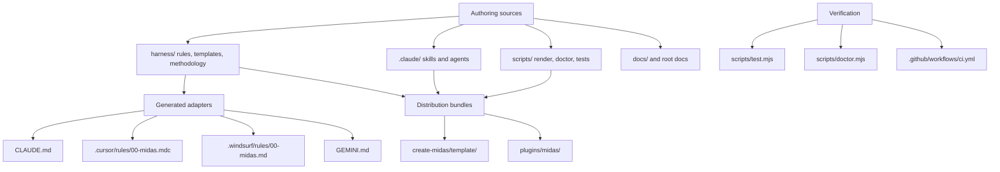
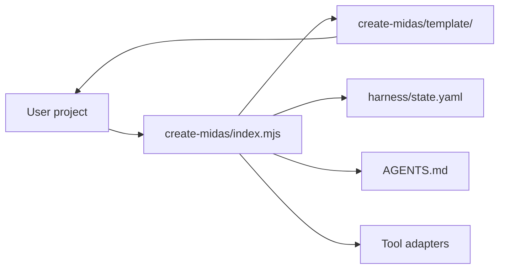

# Repository architecture

This page explains how the Midas repository is organized as an engine. It is for contributors who need
to know which files are source, which files are generated, and which checks keep them in sync.

## Mental model

Midas has three layers:

1. **Authoring sources** — the files humans edit: skills, agents, rules, methodology, templates, docs,
   and dependency-free Node scripts.
2. **Generated adapters and bundles** — tool-specific or distribution-specific copies rendered from
   the sources.
3. **Verification scripts** — structural checks that prove generated files, packaged templates, and
   guardrails still match the intended repository contract.

## Source of truth

| Area | Source files | Generated or checked outputs |
|---|---|---|
| Base conventions and rules | `harness/conventions.md`, `harness/rules/*` | `CLAUDE.md`, `.cursor/rules/00-midas.mdc`, `.windsurf/rules/00-midas.md`, `GEMINI.md` |
| Skills and agents | `.claude/skills/*/SKILL.md`, `.claude/agents/*.md` | `plugins/midas/skills`, `plugins/midas/agents`, `create-midas/template/.claude/*` |
| Installable project template | `harness/*`, `.claude/*`, `.mcp.json`, selected `docs/*`, selected `scripts/*` | `create-midas/template/*` |
| Plugin package | `.claude/*`, `.mcp.json`, plugin metadata in `scripts/build-plugin.mjs` | `plugins/midas/*`, `.claude-plugin/marketplace.json` |
| Documentation site | `docs/*.md`, `mkdocs.yml` | GitHub Pages artifact from `.github/workflows/docs.yml` |
| Version stamp | `harness/VERSION` | `package.json`, `create-midas/package.json`, `gemini-extension.json`, docs version pins |

Generated trees are intentionally committed because users install from the repository and plugin
marketplace paths. They are not hand-edited; CI rebuilds them and fails if they drift.

## Runtime and distribution flow

Fresh installs use `create-midas/index.mjs`. The installer copies `create-midas/template/`, fills the
project-oriented `AGENTS.md`, writes the initial `harness/state.yaml`, fixes Windows MCP launch syntax
when it owns the new `.mcp.json`, and renders adapters so the target project is immediately usable.

Plugin installs use `plugins/midas/`. The plugin delivers Claude Code skills, agents, and MCP config,
but it does not install project rules or adapters by itself. Users still run `/midas-init` once inside
the target project so Midas can write the project-local `AGENTS.md`, adapters, and state file.

## Checks and ownership

`scripts/test.mjs` is the blocking structural suite. It validates JSON, skill and agent frontmatter,
adapter drift, generated package drift, version consistency, gate-check fixtures, CI hardening, and MCP
invariants that should fail CI when broken.

`scripts/doctor.mjs` is the install health checker. It verifies adapter sync and reports advisory
project-health warnings such as stale versions, mismatched routing, missing enforcement configs,
secret-looking MCP values, Windows `npx` MCP launch issues, and inconsistent frozen gate records.

The distinction is intentional:

- Put deterministic repository invariants in `scripts/test.mjs`.
- Put project-local, platform-dependent, or user-owned configuration warnings in `scripts/doctor.mjs`.
- If a generated file changes, update the source and run the renderer/build script rather than editing
  the generated copy directly.

## Common contributor paths

| Change | Edit first | Then run |
|---|---|---|
| Base convention wording | `harness/conventions.md` | `node scripts/render-adapters.mjs`, then `node scripts/doctor.mjs` |
| Always-on rule body | `harness/rules/<topic>.md` | `node scripts/test.mjs` |
| Skill behavior | `.claude/skills/<name>/SKILL.md` | `node scripts/build-plugin.mjs`, `node scripts/build-create.mjs`, `node scripts/test.mjs` |
| Agent model or prompt | `.claude/agents/<name>.md` | `node scripts/build-plugin.mjs`, `node scripts/build-create.mjs`, `node scripts/test.mjs` |
| Installer behavior | `create-midas/index.mjs` | `node scripts/test.mjs` |
| Template content | Source under `.claude/`, `harness/`, selected root files | `node scripts/build-create.mjs`, then `node scripts/test.mjs` |
| Plugin content | Source under `.claude/` or `.mcp.json` | `node scripts/build-plugin.mjs`, then `node scripts/test.mjs` |
| Docs site | `docs/*.md`, `mkdocs.yml` | `mkdocs build` locally if MkDocs is installed, otherwise rely on docs CI |

## Naming and generated-file rules

- Source directories use kebab-case where humans create new files.
- Generated adapters are marked with `<!-- midas:begin -->` / `<!-- midas:end -->` blocks.
- `create-midas/template/` and `plugins/midas/` are generated bundles; edit their sources instead.
- The root `.mcp.json` is user-owned configuration for the engine repo and is copied into generated
  bundles by build scripts. Fresh Windows installs are patched by the installer without overwriting a
  user's existing `.mcp.json`.

## Engine decisions (ADR)

Decisions about the repository itself (not about a product built with Midas) are recorded in
`docs/adr/`. Product ADRs instead live in a project's `product/adr/`.

| ADR | Status | Topic |
|---|---|---|
| [ADR-001](adr/ADR-001-install-layout.md) | proposed | Install layout — consolidate engine internals under `.midas/` (opt-in, classic default) |
