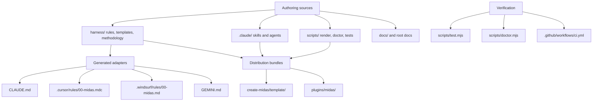
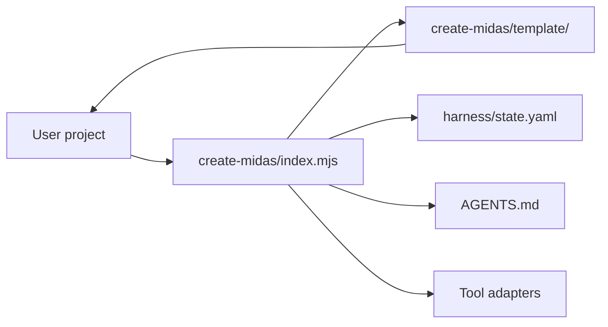

# Repository architecture

This page explains how the Midas repository is organized as an engine. It is for contributors who need
to know which files are source, which files are generated, and which checks keep them in sync.

## Mental model

Midas has three layers:

1. **Authoring sources** — the files humans edit: skills, agents, rules, methodology, templates, docs,
   and dependency-free Node scripts.
2. **Generated adapters and bundles** — tool-specific or distribution-specific copies rendered from
   the sources.
3. **Verification scripts** — structural checks that prove generated files, packaged templates, and
   guardrails still match the intended repository contract.

```mermaid
flowchart TD
  Sources["Authoring sources"]
  Harness["harness/ rules, templates, methodology"]
  Claude[".claude/ skills and agents"]
  Scripts["scripts/ render, doctor, tests"]
  Docs["docs/ and root docs"]

  Adapters["Generated adapters"]
  ClaudeMd["CLAUDE.md"]
  CursorRule[".cursor/rules/00-midas.mdc"]
  WindsurfRule[".windsurf/rules/00-midas.md"]
  Gemini["GEMINI.md"]

  Bundles["Distribution bundles"]
  CreateTemplate["create-midas/template/"]
  PluginTree["plugins/midas/"]

  Checks["Verification"]
  TestScript["scripts/test.mjs"]
  Doctor["scripts/doctor.mjs"]
  CI[".github/workflows/ci.yml"]

  Sources --> Harness
  Sources --> Claude
  Sources --> Scripts
  Sources --> Docs

  Harness --> Adapters
  Claude --> Bundles
  Harness --> Bundles
  Scripts --> Bundles

  Adapters --> ClaudeMd
  Adapters --> CursorRule
  Adapters --> WindsurfRule
  Adapters --> Gemini

  Bundles --> CreateTemplate
  Bundles --> PluginTree

  Checks --> TestScript
  Checks --> Doctor
  Checks --> CI
```

## Source of truth

| Area | Source files | Generated or checked outputs |
|---|---|---|
| Base conventions and rules | `harness/conventions.md`, `harness/rules/*` | `CLAUDE.md`, `.cursor/rules/00-midas.mdc`, `.windsurf/rules/00-midas.md`, `GEMINI.md` |
| Skills and agents | `.claude/skills/*/SKILL.md`, `.claude/agents/*.md` | `plugins/midas/skills`, `plugins/midas/agents`, `create-midas/template/.claude/*` |
| Installable project template | `harness/*`, `.claude/*`, `.mcp.json`, selected `docs/*`, selected `scripts/*` | `create-midas/template/*` |
| Plugin package | `.claude/*`, `.mcp.json`, plugin metadata in `scripts/build-plugin.mjs` | `plugins/midas/*`, `.claude-plugin/marketplace.json` |
| Documentation site | `docs/*.md`, `mkdocs.yml` | `mkdocs build --site-dir _site` locally; GitHub Pages artifact from `.github/workflows/docs.yml` |
| Version stamp | `harness/VERSION` | `package.json`, `create-midas/package.json`, `gemini-extension.json`, docs version pins |

Generated trees are intentionally committed because users install from the repository and plugin
marketplace paths. They are not hand-edited; CI rebuilds them and fails if they drift.

## Local hygiene

| Artifact | Keep in repo? | Action |
|---|---|---|
| `site/` or `_site/` | No (gitignored) | MkDocs output — use `mkdocs build --site-dir _site` locally; delete when done |
| `.harness/*.hash`, `.midas/*.hash` | No (gitignored) | Adapter cache; regenerated by doctor |
| `*.tgz` | No (gitignored) | `npm pack` output |
| `plugins/midas/`, `create-midas/template/` | Yes (generated but committed) | Run `npm run build` after source edits |
| Root `lefthook.yml` | N/A | Not used in the engine repo; product installs scaffold hooks in Phase 5 |

**One command before a PR:** `npm run verify` (test → build-plugin → build-create → doctor).

## Runtime and distribution flow

Fresh installs use `create-midas/index.mjs`. The installer copies `create-midas/template/`, fills the
project-oriented `AGENTS.md`, writes the initial `harness/state.yaml`, fixes Windows MCP launch syntax
when it owns the new `.mcp.json`, and renders adapters so the target project is immediately usable.

```mermaid
flowchart LR
  User["User project"]
  Installer["create-midas/index.mjs"]
  Template["create-midas/template/"]
  State["harness/state.yaml"]
  ProjectLaw["AGENTS.md"]
  Adapters["Tool adapters"]

  User --> Installer
  Installer --> Template
  Template --> User
  Installer --> State
  Installer --> ProjectLaw
  Installer --> Adapters
```

Plugin installs use `plugins/midas/`. The plugin delivers Claude Code skills, agents, and MCP config,
but it does not install project rules or adapters by itself. Users still run `/midas-init` once inside
the target project so Midas can write the project-local `AGENTS.md`, adapters, and state file.

## Checks and ownership

`scripts/test.mjs` is the blocking structural suite. It validates JSON, skill and agent frontmatter,
adapter drift, generated package drift, version consistency, gate-check fixtures, CI hardening, and MCP
invariants that should fail CI when broken.

`scripts/doctor.mjs` is the install health checker. It verifies adapter sync and reports advisory
project-health warnings such as stale versions, mismatched routing, missing enforcement configs,
secret-looking MCP values, Windows `npx` MCP launch issues, MCP drift (`scripts/mcp-drift.mjs` —
`state.yaml → mcp:` and skill `mcp-required` vs `.mcp.json`), and inconsistent frozen gate records.

The distinction is intentional:

- Put deterministic repository invariants in `scripts/test.mjs`.
- Put project-local, platform-dependent, or user-owned configuration warnings in `scripts/doctor.mjs`.
- If a generated file changes, update the source and run the renderer/build script rather than editing
  the generated copy directly.

## Common contributor paths

| Change | Edit first | Then run |
|---|---|---|
| Base convention wording | `harness/conventions.md` | `npm run render`, then `npm run doctor` |
| Always-on rule body | `harness/rules/<topic>.md` | `npm test` |
| Skill behavior | `.claude/skills/<name>/SKILL.md` | `npm run build`, `npm test` |
| Agent model or prompt | `.claude/agents/<name>.md` | `npm run build`, `npm test` |
| Installer behavior | `create-midas/index.mjs` | `npm test` |
| Template content | Source under `.claude/`, `harness/`, selected root files | `npm run build`, `npm test` |
| Plugin content | Source under `.claude/` or `.mcp.json` | `npm run build`, `npm test` |
| Docs site | `docs/*.md`, `mkdocs.yml` | `mkdocs build --site-dir _site` locally, or rely on docs CI |
| Any mixed change | sources above | `npm run verify` |

## Naming and generated-file rules

- Source directories use kebab-case where humans create new files.
- Generated adapters are marked with `<!-- midas:begin -->` / `<!-- midas:end -->` blocks.
- `create-midas/template/` and `plugins/midas/` are generated bundles; edit their sources instead.
- The root `.mcp.json` is user-owned configuration for the engine repo and is copied into generated
  bundles as a **minimal default** (typically `sequential-thinking` only). The full optional catalog
  lives in `harness/templates/mcp.json.tmpl`; `/midas-init` merges chosen servers into the project
  `.mcp.json` — the template file is reference, not what `build-create.mjs` ships byte-for-byte.
  Fresh Windows installs are patched by the installer without overwriting a user's existing `.mcp.json`.

## Engine decisions (ADR)

Decisions about the repository itself (not about a product built with Midas) are recorded in
`docs/adr/`. Product ADRs instead live in a project's `product/adr/`.

| ADR | Status | Topic |
|---|---|---|
| [ADR-001](adr/ADR-001-install-layout.md) | accepted | Install layout — consolidate engine internals under `.midas/` (opt-in `--layout=compact`, classic default) |
| [ADR-002](adr/ADR-002-code-intelligence-mcp.md) | rejected | Optional code-intelligence MCP (code-graph) — rejected: too much install complexity for a dependency-free harness |
| [ADR-003](adr/ADR-003-project-memory-model.md) | accepted | Project memory model — `state.yaml` spine + `{runs}/*` records (`.harness/` or `.midas/`) |

## Install layouts (classic vs compact)

Product installs default to **classic** (`harness/`, `scripts/`, `.harness/` at the project root). **`--layout=compact`** relocates engine internals under `.midas/` while tool-mandated paths stay at the root. Path resolution is centralized in `scripts/paths.mjs`; skills read `layout` + `paths` from state and substitute `{runs}/` tokens in pipeline prose. See [ADR-001](adr/ADR-001-install-layout.md) and [INSTALL.md](../INSTALL.md).
