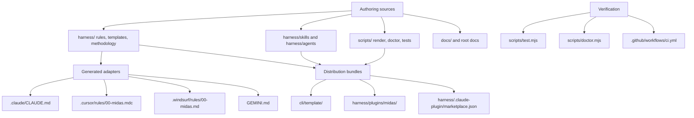
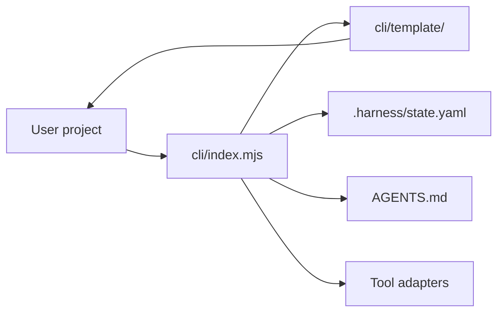

# Repository architecture

This page explains how the Midas repository is organized as an engine. It is for contributors who need
to know which files are source, which files are generated, and which checks keep them in sync.

## Mental model

Midas has three layers:

1. **Authoring sources** — the files humans edit: skills, agents, rules, methodology, templates, docs,
   and dependency-free Node scripts.
2. **Generated adapters and bundles** — tool-specific or distribution-specific copies rendered from
   the sources.
3. **Verification scripts** — structural checks that prove generated files, packaged templates, and
   guardrails still match the intended repository contract.


```mermaid
flowchart TD
  Sources["Authoring sources"]
  Harness["harness/ rules, templates, methodology"]
  Skills["harness/skills and harness/agents"]
  Scripts["scripts/ render, doctor, tests"]
  Docs["docs/ and root docs"]

  Adapters["Generated adapters"]
  ClaudeMd[".claude/CLAUDE.md"]
  CursorRule[".cursor/rules/00-midas.mdc"]
  WindsurfRule[".windsurf/rules/00-midas.md"]
  Gemini["GEMINI.md"]

  Bundles["Distribution bundles"]
  CreateTemplate["cli/template/"]
  PluginTree["harness/plugins/midas/"]
  MarketplaceCatalog["harness/.claude-plugin/marketplace.json"]

  Checks["Verification"]
  TestScript["scripts/test.mjs"]
  Doctor["scripts/doctor.mjs"]
  CI[".github/workflows/ci.yml"]

  Sources --> Harness
  Sources --> Skills
  Sources --> Scripts
  Sources --> Docs

  Harness --> Adapters
  Skills --> Bundles
  Harness --> Bundles
  Scripts --> Bundles

  Adapters --> ClaudeMd
  Adapters --> CursorRule
  Adapters --> WindsurfRule
  Adapters --> Gemini

  Bundles --> CreateTemplate
  Bundles --> PluginTree
  Bundles --> MarketplaceCatalog

  Checks --> TestScript
  Checks --> Doctor
  Checks --> CI
```

## Source of truth

| Area | Source files | Generated or checked outputs |
|---|---|---|
| Base conventions and rules | `harness/conventions.md`, `harness/rules/*` | `.claude/CLAUDE.md`, `.cursor/rules/00-midas.mdc`, `.windsurf/rules/00-midas.md`, `GEMINI.md` |
| Skills and agents | `harness/skills/*/SKILL.md`, `harness/agents/*.md` | `.claude/*`, `.agents/skills`, plugins, installer template |
| Installable project template | `harness/*`, `.mcp.json`, selected `docs/*`, selected `scripts/*` | `cli/template/*` |
| Installer CLI (zero-dep) | `cli/index.mjs`, `cli/lib/**` (npm package name `create-midas`) | `npx` / `create-midas` bin; lifecycle: requirements → checks → plan → confirm → execute → verify |
| Plugin package | `harness/skills`, `harness/agents`, `.mcp.json`, metadata in `scripts/build-plugin.mjs` | `harness/plugins/midas/*`, `harness/.claude-plugin/marketplace.json` |
| Documentation site | `docs/*.md`, `mkdocs.yml` | `mkdocs build --site-dir _site` locally; GitHub Pages artifact from `.github/workflows/docs.yml` |
| Version stamp | `harness/VERSION` | `npm run bump -- <ver>` → packages, state stamps, `INSTALL.md` `#v…` pins, rebuild |

Generated trees are intentionally committed because users install from the repository and plugin
marketplace paths. They are not hand-edited; CI rebuilds them and fails if they drift.

## Local hygiene

| Artifact | Keep in repo? | Action |
|---|---|---|
| `site/` or `_site/` | No (gitignored) | MkDocs output — use `mkdocs build --site-dir _site` locally; delete when done |
| `.harness/cache/*`, `.harness/migrations/backups/*`, `runs/cache/*` | No (gitignored) | Local cache and rollback material (engine Trace uses `runs/cache/`) |
| `*.tgz` | No (gitignored) | `npm pack` output |
| `harness/plugins/midas/`, `harness/.claude-plugin/`, `cli/template/` | Yes (generated but committed) | Run `npm run build` after source edits |
| Root `lefthook.yml` | N/A | Not used in the engine repo; product installs scaffold hooks in Phase 5 |

**One command before a PR:** `npm run align` (render adapters → test → build bundles → doctor).
Rule: `<paths.engine>/rules/change-propagation.md`. Skill: `/midas-align`.

## Runtime and distribution flow

Fresh installs use `cli/index.mjs` (npm `create-midas`). The installer copies `cli/template/`, fills the
project-oriented `AGENTS.md`, writes the initial `.harness/state.yaml`, fixes Windows MCP launch syntax
when it owns the new `.mcp.json`, and renders adapters so the target project is immediately usable.


```mermaid
flowchart LR
  User["User project"]
  Installer["cli/index.mjs"]
  Template["cli/template/"]
  State[".harness/state.yaml"]
  ProjectLaw["AGENTS.md"]
  Adapters["Tool adapters"]

  User --> Installer
  Installer --> Template
  Template --> User
  Installer --> State
  Installer --> ProjectLaw
  Installer --> Adapters
```

Plugin installs use `harness/plugins/midas/` (listed by `harness/.claude-plugin/marketplace.json`).
The plugin delivers Claude Code skills, agents, and MCP config, but it does not install project rules
or adapters by itself. Users still run `/midas-init` once inside the target project so Midas can write
the project-local `AGENTS.md`, adapters, and state file.

**Claude Code marketplace flow (engine repo):** clone this repository, then:

```text
/plugin marketplace add ./harness
/plugin install midas@midas
/midas-init
```

The catalog lives under `harness/.claude-plugin/` (not repo root), so `/plugin marketplace add
okuzpe/midas-harness` without a local clone will not find it. For a one-shot install without cloning,
use `npx create-midas` or `npx github:okuzpe/midas-harness` — see [INSTALL.md](../INSTALL.md).

## Checks and ownership

`scripts/test.mjs` is the blocking structural suite. It validates JSON, skill and agent frontmatter,
adapter drift, generated package drift, version consistency, gate-check fixtures, CI hardening, and MCP
invariants that should fail CI when broken.

`scripts/doctor.mjs` is the install health checker. In strict mode it blocks deterministic drift in
layout, ownership, mirrors, adapters, version, routing, and generated registries. It also reports advisory
project-health warnings such as missing enforcement configs,
secret-looking MCP values, Windows `npx` MCP launch issues, MCP drift (`scripts/mcp-drift.mjs` —
`state.yaml → mcp:` and skill `mcp-required` vs `.mcp.json`), and inconsistent frozen gate records.

The distinction is intentional:

- Put deterministic repository invariants in `scripts/test.mjs`.
- Put project-local, platform-dependent, or user-owned configuration warnings in `scripts/doctor.mjs`.
- If a generated file changes, update the source and run the renderer/build script rather than editing
  the generated copy directly.

## Common contributor paths

| Change | Edit first | Then run |
|---|---|---|
| Base convention wording | `harness/conventions.md` | `npm run render`, then `npm run doctor` |
| Always-on rule body | `harness/rules/<topic>.md` | `npm test` |
| Skill behavior | `harness/skills/<name>/SKILL.md` | `npm run build`, `npm test` |
| Agent model or prompt | `harness/agents/<name>.md` | `npm run build`, `npm test` |
| Installer behavior | `cli/index.mjs` | `npm test` |
| Template content | `harness/`, `scripts/` subset, selected `docs/*` / root files (never hand-edit `cli/template/`) | `npm run build`, `npm test` |
| Plugin content | `harness/skills/`, `harness/agents/`, root `.mcp.json`, metadata in `scripts/build-plugin.mjs` (never hand-edit `harness/plugins/midas/` or `harness/.claude-plugin/`) | `npm run build`, `npm test` |
| Docs site | `docs/*.md`, `mkdocs.yml` | `mkdocs build --site-dir _site` locally, or rely on docs CI |
| Any mixed change | sources above | `npm run align` (or `/midas-align`) |
| Portable knowledge transfer | `scripts/bundle.mjs`, `harness/skills/midas-bundle/` | `/midas-bundle` or `node scripts/bundle.mjs export|import` |

## Naming and generated-file rules

- Source directories use kebab-case where humans create new files.
- Generated adapters are marked with `<!-- midas:begin -->` / `<!-- midas:end -->` blocks.
- `cli/template/`, `harness/plugins/midas/`, and `harness/.claude-plugin/` are generated bundles;
  edit their sources instead.
- The root `.mcp.json` is user-owned configuration for the engine repo and is copied into generated
  bundles as an **empty default**. The optional Runlayer guidance lives in
  `harness/templates/mcp.json.tmpl`; `/midas-init` records only explicitly approved servers in the
  project `.mcp.json` — the template file is reference, not what `build-create.mjs` ships byte-for-byte.
  Fresh Windows installs are patched by the installer without overwriting a user's existing `.mcp.json`.

## Engine decisions (ADR)

Decisions about the repository itself (not about a product built with Midas) are recorded in
`docs/adr/`. Product ADRs instead live in a project's `product/adr/`.

| ADR | Status | Topic |
|---|---|---|
| [ADR-001](adr/ADR-001-install-layout.md) | accepted | Install layout — compact opt-in (superseded default → ADR-006 hub) |
| [ADR-006](adr/ADR-006-hub-layout.md) | superseded for new installs | Historical v1 hub layout |
| [ADR-007](adr/ADR-007-canonical-harness-layout.md) | accepted | One installed `.harness/` layout; supersedes ADR-001/006 for new installs |
| [ADR-002](adr/ADR-002-code-intelligence-mcp.md) | rejected | Optional code-intelligence MCP (code-graph) — rejected: too much install complexity for a dependency-free harness |
| [ADR-003](adr/ADR-003-project-memory-model.md) | accepted | Project memory model — `.harness/state.yaml` spine + `.harness/runs/*` records |
| [ADR-004](adr/ADR-004-audit-skill-surface.md) | accepted (deferred) | Audit skill surface — keep tribunal/security/close-sprint separate |
| [ADR-005](adr/ADR-005-agents-md-generation.md) | accepted | AGENTS.md summary manual; adapter digest Option A |
| [ADR-008](adr/ADR-008-thin-root-allowlist.md) | accepted | Thin root allowlist for host discovery |
| [ADR-009](adr/ADR-009-optional-autonomy-control-plane.md) | accepted | Optional autonomy control plane (`--autonomy`) |
| [ADR-010](adr/ADR-010-harness-trace-observe.md) | accepted | Harness trace observe (engine contributors) |
| [ADR-011](adr/ADR-011-harness-trace-installs.md) | accepted | Harness trace on installs |

## Glossary — two kinds of "bundle"

| Term | What it is | Where |
|---|---|---|
| **Distribution bundle** | Generated install trees copied from source | `cli/template/`, `harness/plugins/midas/`, `harness/.claude-plugin/` via `build-create.mjs` / `build-plugin.mjs` |
| **Portable JSON bundle** | Export/import of project memory (state, product docs, rules subset) | `scripts/bundle.mjs`, `/midas-bundle` skill |

Do not confuse `npm run build` (distribution) with `node scripts/bundle.mjs export` (portable knowledge).

## Install layouts

New **product** installs use one canonical `.harness/` tree with a **thin root** (ADR-007 + ADR-008).
Default `--tools=cursor` → skills under `.cursor/skills/` only. Classic, compact, and hub are
read-only migration inputs; `--update` never relocates them. Path resolution is in
`scripts/paths.mjs`; skills read `layout` + `paths` from state and substitute `{runs}/` and
`{product}/` tokens. Update / conflict / ownership-manifest **rebaseline** contract:
[INSTALL.md § Updating an existing install](../INSTALL.md#updating-an-existing-install)
(guards: `installer:update-stale-manifest-rebaseline`, `installer:update-vendor-conflict-prewrite`).

**Optional autonomy** (ADR-009): `create-midas --autonomy` copies `harness/autonomy/` →
`.harness/autonomy/` (bounded control plane + `midas-autopilot.mjs` CLI; editor slash `/midas-auto-sprints`). Absent the flag, installs get
no autonomy tree and no `@cursor/sdk`. Policy/ledger/journal stay outside the lifecycle FSM.

The **engine repository** (this repo) uses **classic** layout metadata in `harness/state.yaml`
(authored source in `harness/` + `scripts/`, installer in `cli/`). It does **not** run the Midas
lifecycle on itself — see `docs/dogfood.md`. `runs/cache/` (gitignored) is Trace observe tooling for
contributors. Lifecycle CI demo: `docs/research/taskpilot/`.

## Glossary — engine `runs/` vs install `.harness/runs/`

| Context | Evidence path | Resolved from |
|---|---|---|
| **Engine repo** | No committed lifecycle evidence; `runs/cache/` for Trace | `harness/state.yaml` → `paths.cache` |
| **Product install (ADR-007)** | `.harness/runs/{audits,sprints,…}` | `.harness/state.yaml` → `paths.runs` |
| **Token `{runs}/`** | Install layouts | Substitute `paths.runs` from the active state file |

Never create `.harness/engine/` or `.harness/state.yaml` at the engine repository root. The installer
refuses that layout (`node cli/index.mjs --dry-run .`). See `harness/rules/engine-repo-boundary.md`.
