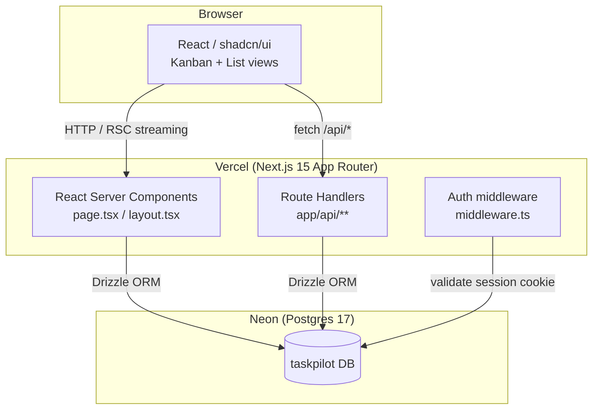

# TaskPilot — Technical Architecture

> Phase 4 artifact. Gate requires: stack pinned & Context7-verified, architecture diagram, ≥ 1 ADR, all requirements covered.

---

## Stack (pinned versions)

| Layer | Choice | Version | Rationale |
|---|---|---|---|
| Framework | Next.js (App Router) | 15.3.x | Full-stack React framework; RSC + API routes eliminate a separate backend process; large community |
| Language | TypeScript | 5.8.x | Type safety across shared schema; catches contract mismatches between DB and UI |
| Database | PostgreSQL | 17.x | Proven relational DB; row-level tenant isolation straightforward; hosted on Neon (serverless Postgres) |
| ORM | Drizzle ORM | 0.40.x | Lightweight, type-safe, SQL-first; no "magic" query builder; Context7-verified API |
| Auth | custom sessions | — | bcrypt password hashing + HTTP-only cookie sessions; no external auth provider in v1 |
| UI components | shadcn/ui | latest pinned | Headless Radix primitives + Tailwind; zero runtime; design-token-compatible |
| Styling | Tailwind CSS | 4.x | Utility-first; consumed via design token CSS variables defined in `product/design-system.md` |
| Testing | Vitest | 3.x | Fast unit/integration tests; compatible with the Next.js project structure |
| Hosting | Vercel | — | Zero-config Next.js deployment; preview deployments for PRs |
| CI | GitHub Actions | — | Lint + type-check + test on every push |

> Context7 verification: Drizzle ORM and Next.js App Router docs were fetched via `resolve-library-id` →
> `get-library-docs` at the pinned versions above before finalising this architecture. See ADR-001.

---

## Architecture diagram



---

## How requirements map to the stack

| Business requirement | Architectural decision |
|---|---|
| Task CRUD | Drizzle schema `tasks` table; Route Handlers `POST/GET/PATCH/DELETE /api/tasks` |
| Auth (email + password) | `users` table with bcrypt-hashed password; session stored in `sessions` table; HTTP-only cookie |
| Kanban board | Client component with `@dnd-kit/core` for drag-and-drop; status update via `PATCH /api/tasks/:id` |
| List view | RSC page with server-side sort/filter params; no client JS required for rendering |
| Comments | `comments` table with FK to `tasks`; `POST /api/tasks/:id/comments` |
| Multi-tenant isolation | `workspace_id` column on every table; all queries scoped by workspace from session |
| ≤ 5-minute onboarding | Single-page signup → auto-create workspace → redirect to empty board |

---

## Folder structure (enforced by Phase 5 rules)

```
taskpilot/
  src/
    app/
      (auth)/           # login, register pages (no layout shell)
      (app)/            # authenticated pages — layout.tsx wraps with auth guard
        board/          # kanban view
        tasks/          # list view
      api/
        tasks/          # CRUD route handlers
        comments/
        auth/
    lib/
      db/
        schema.ts       # Drizzle schema (single source of truth for all table shapes)
        index.ts        # db client singleton
      auth/
        session.ts      # session read/write helpers
        password.ts     # bcrypt wrappers
    components/
      ui/               # shadcn/ui primitives (auto-generated, do not hand-edit)
      task-card.tsx
      kanban-board.tsx
    types/
      index.ts          # shared TypeScript types (inferred from Drizzle schema)
  drizzle/
    migrations/         # generated migration files
  drizzle.config.ts
  vitest.config.ts
```

---

## ADRs

- [ADR-001: Stack selection](adr/ADR-001-stack.md)

---

## Phase 4 gate verdict

- [x] Stack pinned with exact versions
- [x] Context7 fetch performed for Drizzle ORM and Next.js before finalising choices (noted above)
- [x] Architecture diagram present (Mermaid)
- [x] All MVP requirements traced to an architectural decision
- [x] ≥ 1 ADR written (ADR-001)
- [x] Folder structure defined

Phase 4 exit gate: **PASSED**. Audited by: midas-orchestrator on 2026-06-16.
